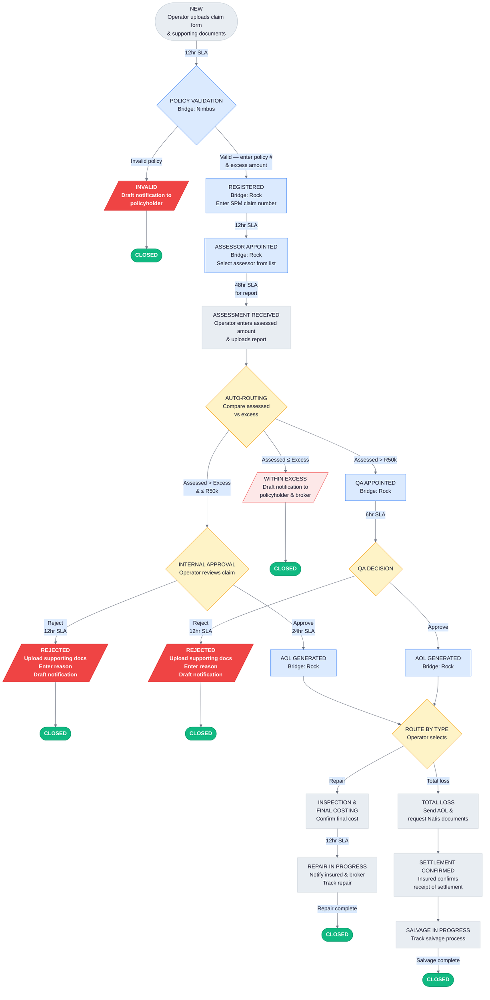
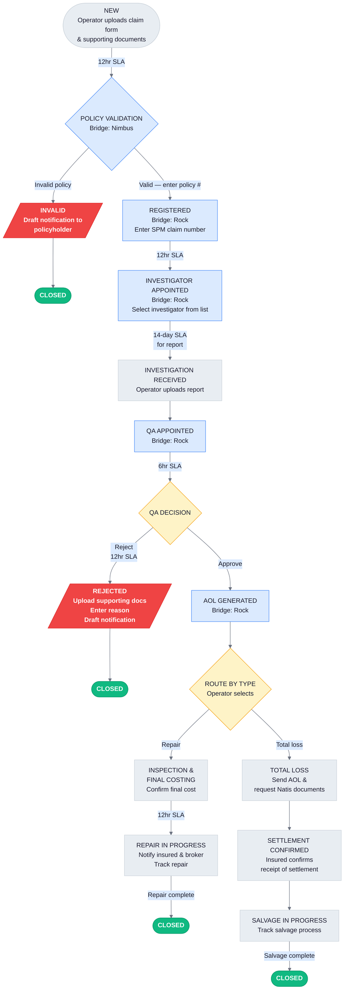
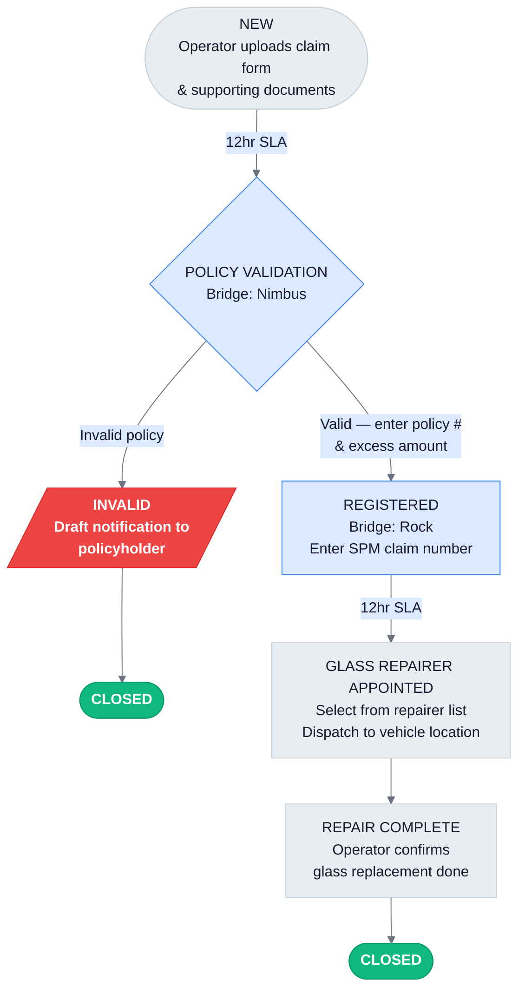

# ClaimPilot MVP -- Product requirements document (V2)

## RTU Insurance Services (RTUSA)

**Version:** 2.3
**Date:** 2026-03-29
**Author:** TrueAim.ai
**Status:** Draft
**Previous version:** V2.2 (2026-03-28), V2.1 (2026-03-27), V2.0 (2026-03-27), V1 (2026-03-26)

### Change log

**V2.3 (2026-03-29)** — Prototype alignment and feature documentation

- **Claim type comparison table added (section 5.5).** Side-by-side matrix showing which workflow capabilities apply to each claim type (accident, theft, glass). Added to prevent future modelling errors where one flow is incorrectly assumed to mirror another.
- **Theft investigation received clarified (section 5.6.5).** Explicit statement that no financial data is entered at this step — operator uploads report only, claim auto-advances to QA. Previously the description was minimal and led to the theft flow being implemented as a copy of accident.
- **QA step differentiated by claim type (section 5.6.8).** QA serves different purposes depending on how the claim arrived: value-based threshold for accident, mandatory review for theft. Description updated to reflect both contexts.
- **Workflow fields table tightened (section 4.1).** Excess amount wording changed from "not applicable to theft" to "not collected for theft" to match implementation where the field is actively hidden, not just optional.
- **Step revert capability documented (section 5.7).** Operators can revert a claim to its previous workflow state from any active step. Revert re-activates the prior SLA timer, preserves all entered data and communications, and logs the action in the audit trail. Not available from NEW or CLOSED states.
- **Demo fast-forward clock documented (section 5.8).** Prototype-only feature that shifts all SLA timestamps to simulate the passage of time. Used during stakeholder demos to show SLA progression, approaching, and breach scenarios without waiting.
- **Communication templates expanded (section 7.3).** Detailed the 12 auto-generated draft email templates with trigger conditions, recipients, and content summaries. Added lifecycle description covering draft generation, copy-to-clipboard, and mark-as-sent workflow.

**V2.2 (2026-03-28)** — Theft workflow correction

- **Theft workflow: removed excess and internal approval paths.** Cross-referenced against the RTU Optimised Claims Flow spec diagram. The theft flow was incorrectly modelled as a copy of the accident flow with only the assessor/investigator step changed. In the spec, theft claims do not collect excess at policy validation, do not compare assessed amount vs excess, and do not route through internal approval. All theft claims go directly from investigation received to QA appointed, regardless of claim value, because theft claims are inherently higher risk and require QA oversight.
- **Sections updated:** 5.2 (theft diagram), 5.6.2 (policy validation), 5.6.5 (assessment/investigation received), 5.6.6 (within excess — now accident only), 5.6.7 (internal approval — now accident only), workflow fields table (excess and assessed amount scoped to accident), tenant config (approval threshold note).
- **Standalone diagram updated:** `docs/poc/diagrams/workflow-theft.mmd` rewritten to match.

---

## 1. Overview

### 1.1 What is ClaimPilot?

ClaimPilot is a multi-tenant SaaS workflow tool for insurance claims management. It gives claims operators a single workspace to manage the claim lifecycle, track SLAs, generate draft communications, and monitor operations through a dashboard.

### 1.2 Context

RTU Insurance Services (RTUSA) is an underwriting management agency handling motor claims for taxis insured through Renasa. Their current process spans three disconnected systems (Zoho for CRM, Nimbus for policy admin, Rock for insurer claims admin) with claims tracked manually on Google Sheets. There is no workflow management, no SLA visibility, no automated communications, and no proactive follow-up with assessors, investigators, or repairers.

### 1.3 MVP objective

Replace the Google Sheets tracking with a workflow tool. ClaimPilot manages the claim lifecycle, enforces SLA tracking, generates draft communications, and gives management operational visibility. No integration to Rock, Nimbus, or other external systems in MVP.

### 1.4 Success criteria

- RTU can manage 100% of active claims within ClaimPilot
- Full visibility into claim status across all workflow stages
- SLA compliance is measurable and tracked per step
- Assessor/investigator/repairer follow-up is proactive via draft reminders
- Claim cycle time is measurable and reducible

---

## 2. Architecture principles

### 2.1 Multi-tenant SaaS

ClaimPilot is a multi-tenant platform. RTU is the first tenant. All tenant-specific configuration (SLA thresholds, approval limits, claim types, workflow steps) is scoped per tenant. The data model, authentication, and configuration layer support multi-tenancy from day one.

### 2.2 No external integrations (MVP)

Rock and Nimbus interactions are modelled as manual bridge steps. The system prompts the operator to perform an action in the external system, provides the necessary data with copy buttons, and the operator confirms completion and enters any return data (e.g. SPM claim number, policy number). Bridge steps are structured so they can be replaced with API calls later without changing the workflow.

### 2.3 Tech stack

- Frontend: React, Tailwind CSS, shadcn/ui
- Document extraction: Existing TrueAim extraction pipeline
- Background processing: Scheduler for SLA monitoring and reminder generation

---

## 3. Users and access

### 3.1 User roles (MVP)

A single role with full access for all RTU team members. No role-based permissions in MVP.

| User type | Access | Authentication |
|---|---|---|
| RTU Operator / Claims Consultant | Full access to all claims and features within their tenant | Email / password |
| RTU Management | Same full access; uses dashboard for oversight | Email / password |
| TrueAim Admin | Cross-tenant platform access | Email / password |

### 3.2 External parties (no login)

Assessors, investigators, repairers, policyholders, and brokers do not log into ClaimPilot. They interact only through emails drafted within the system and sent manually by the operator.

---

## 4. Claim data model

### 4.1 Claim record

The claim record maps to the fields required by Rock for claim registration. Three claim form types exist (accident, theft, glass), each with different field requirements. Full field specs are in `docs/poc/specs/`.

#### Core fields (all claim types)

| Field | Source | Notes |
|---|---|---|
| Claim ID | System-generated | Internal ClaimPilot reference |
| Claim type | Extracted from claim form | Accident / Theft / Glass |
| Status | System-managed | Current workflow state |
| Assigned to | Auto-assigned | User who created the claim |
| Created at | System-generated | |
| Updated at | System-generated | |

#### Insured details (accident/theft)

| Field | Source | Required |
|---|---|---|
| Insured name (first/last/middle) | Extracted | Yes |
| Company name / surname and initials | Extracted | Yes |
| Company registration number | Extracted | No |
| VAT number | Extracted | No |
| Identity number | Extracted | Yes |
| Occupation or business | Extracted | Yes |
| Physical address | Extracted | No |
| Postal address | Extracted | No |
| Business contact number | Extracted | Yes |
| Home contact number | Extracted | No |
| Cell phone number | Extracted | Yes |

#### Insured details (glass)

| Field | Source | Required |
|---|---|---|
| Policy number | Extracted | Yes |
| Insured's contact number | Extracted | Yes |
| Email | Extracted | No |
| Address | Extracted | No |

#### Broker details

| Field | Source | Required |
|---|---|---|
| Broker name | Extracted | Yes (accident/theft) |
| Broker's email address | Extracted | No |
| Client's email address | Extracted | No |

#### Driver details

| Field | Source | Required |
|---|---|---|
| Driver name (first/last) | Extracted | Yes |
| Driver ID number | Extracted | Yes |
| Driver's contact number | Extracted | Yes (glass) |

Pre-filled from insured details by default. Operator overrides if the driver is a different person.

#### Vehicle details

| Field | Source | Required (Acc/Theft) | Required (Glass) |
|---|---|---|---|
| Vehicle year, make and model | Extracted | Yes | Yes |
| Registration number | Extracted | Yes | Yes |
| Vehicle value (ZAR) | Extracted | Yes | No |
| Kilometres completed | Extracted | Yes | No |
| VIN | Extracted | Yes | Yes |
| Chassis number | Extracted | Yes | No |
| Engine number | Extracted | Yes | Yes |
| Exterior colour | Extracted | Yes | No |
| Interior colour | Extracted | Yes | No |

#### Finance details (accident/theft only)

| Field | Source | Required |
|---|---|---|
| Finance company | Extracted | No |
| Account number | Extracted | No |
| Outstanding amount (ZAR) | Extracted | No |
| Type of agreement | Extracted | Yes |

Captured for Rock registration. ClaimPilot does not act on finance details (no communications to finance companies, no settlement splitting). See Assumptions section.

#### Incident details

| Field | Source | Required (Acc/Theft) | Required (Glass) |
|---|---|---|---|
| Incident date and time | Extracted | Yes | Yes |
| Place / location | Extracted | Yes | Yes |
| Circumstances | Extracted | Yes | No |
| Police station reference number | Extracted | Yes | No |
| Date reported (to police) | Extracted | Yes | No |
| Vehicle locked? (reasons if not) | Extracted | No | No |
| Stolen accessories details | Extracted | No | No |
| Current vehicle location | Extracted | No | Yes |
| Cause of loss | Extracted | No | Yes (glass dropdown) |
| Which glass to be replaced | Extracted | No | Yes (glass dropdown) |

#### Workflow fields

| Field | Source | Notes |
|---|---|---|
| Policy number | Manual entry | Operator enters after Nimbus lookup |
| SPM claim number (Rock) | Manual entry | Operator enters after Rock registration |
| Excess amount | Manual entry | Operator enters from policy on Nimbus (accident/glass only; not collected for theft — field is hidden) |
| Assessed amount | Manual entry | Operator enters from assessor report (accident only; theft and glass do not enter an assessed amount) |
| Assessor / investigator | Selected from list | Name, contact details |
| Rejection reason | Manual entry | Free text, only on rejected claims |
| Rejection supporting documents | Manual upload | Required before rejection decision is finalized |

#### Anti-theft / recovery device (accident/theft only, optional)

| Field | Source |
|---|---|
| Device date | Extracted |
| Fitted by | Extracted |
| Device make | Extracted |
| Window markings number | Extracted |
| Applied by whom | Extracted |
| Scratches, dents, defects | Extracted |
| Other identifying features | Extracted |

#### Field editability

All fields are editable at any workflow stage. Every change is logged in the audit trail. If a field changes after Rock registration, the operator is responsible for updating Rock manually (same as today).

### 4.2 Documents

Documents are uploaded, stored, and associated to the claim. Each document has a type. Only the claim form is parsed for extraction in MVP.

| Document type | Accident | Theft | Glass |
|---|---|---|---|
| Claim form | Required | Required | Required |
| Police report | Required | Required | Not required |
| Owner's ID | Required | Required | Not required |
| License disk | Required | Required | Not required |
| Vehicle registration document | Required | Required | Not required |
| Driver license | Required | Required | Required |
| Detailed trip log | Optional | Optional | Not required |
| Damage photos | Not required | Not required | Required |

| Capability | MVP scope |
|---|---|
| Upload and store | Yes |
| Associate to claim with document type | Yes |
| Extract data from claim form | Yes |
| Extract data from supporting docs | No |
| Completeness checking | No |
| Fraud detection | No (post-MVP) |

### 4.3 Contacts: assessors, investigators, repairers

A tenant-level managed list of external parties with contact details (name, email, phone, type). Selected from a dropdown when appointing to a claim.

---

## 5. Claim lifecycle and workflow

### 5.1 Accident workflow

> Standalone diagram file: `docs/poc/diagrams/workflow-accident.mmd`

### 5.2 Theft workflow

> Standalone diagram file: `docs/poc/diagrams/workflow-theft.mmd`

Theft claims skip excess collection, excess-based auto-routing, and internal approval. All theft claims go directly from investigation to QA regardless of claim value, because theft claims are inherently higher risk and require QA oversight.

### 5.3 Glass workflow

> Standalone diagram file: `docs/poc/diagrams/workflow-glass.mmd`

Glass claims skip assessment, auto-routing, approval, total loss, and salvage. The glass replacement company is dispatched to the vehicle's current location.

### 5.5 Claim type comparison

The three claim types share a common workflow skeleton but differ significantly in which steps apply. This matrix summarises the differences to prevent one flow being incorrectly modelled as a copy of another.

| Capability | Accident | Theft | Glass |
|---|---|---|---|
| Excess collected at policy validation | Yes | **No** | Yes |
| Assessed amount entered | Yes (from assessor report) | **No** | No |
| Auto-routing (assessed vs excess) | Yes | **No** | No |
| Within Excess path | Yes | **No** | No |
| Internal Approval path (<=R50k) | Yes | **No** | No |
| QA path | >R50k only | **All claims** (mandatory) | No |
| External party appointed | Assessor | Investigator | Glass repairer |
| Report SLA | 48h (assessor) | 14 days (investigator) | N/A |
| Repair / total loss routing | Yes | Yes | No |
| Total loss / salvage path | Yes | Yes | No |
| Police reference required | Yes | Yes | No |
| Finance details captured | Yes | Yes | No |

### 5.6 Workflow step details

#### 5.6.1 NEW: claim creation

- Trigger: operator uploads claim form and supporting documents
- System: extract data from claim form, auto-populate claim record
- Operator: review extracted data, correct errors, complete missing fields, confirm creation
- Auto-assignment: claim assigned to the creating operator
- Outcome: claim enters POLICY VALIDATION

#### 5.6.2 Policy validation

- Type: manual bridge step (Nimbus)
- System: display policyholder and vehicle details with copy buttons for Nimbus lookup
- Operator: check policy validity on Nimbus, return to ClaimPilot, enter policy number and excess amount (accident/glass only — theft claims do not collect excess), confirm valid or mark invalid
- SLA: configurable (default: 12 hours)
- Invalid path: status set to INVALID, draft notification to policyholder, claim closed

#### 5.6.3 Registered

- Type: manual bridge step (Rock)
- System: display claim data with copy buttons for Rock registration
- Operator: register claim on Rock, enter SPM claim number into ClaimPilot, confirm
- SLA: included in the 12-hour policy validation SLA (combined step)
- Outcome: claim moves to assessor/investigator/repairer appointment

#### 5.6.4 Assessor / investigator / glass repairer appointed

- Type: manual bridge step (Rock, except glass repairer which is direct)
- System: display claim details, operator selects external party from managed list
- Operator: appoint on Rock (accident/theft) or contact directly (glass), confirm in ClaimPilot
- SLA for appointment: configurable (default: 12 hours from registration)
- SLA for report: configurable (default: 48 hours from appointment; glass: N/A)
- Reminders: draft email reminders at configurable intervals approaching and after SLA breach

#### 5.6.5 Assessment / investigation received

**Accident claims:**
- Trigger: operator enters assessed amount and uploads assessor report
- System auto-routing:
  - Assessed amount <= excess: WITHIN EXCESS
  - Assessed amount > excess AND <= configurable threshold (default R50,000): INTERNAL APPROVAL
  - Assessed amount > configurable threshold: QA APPOINTED

**Theft claims:**
- Trigger: operator uploads investigator report and confirms receipt
- No financial data is entered at this step — theft claims do not have an assessed amount and do not undergo excess-based routing
- Routing: all theft claims advance directly to QA APPOINTED regardless of claim value (no excess check, no within-excess path, no internal approval path)

#### 5.6.6 Within excess (accident only)

- Applies to: accident claims only (theft claims skip excess routing entirely)
- System: draft notification to policyholder and broker (claim is within excess)
- Outcome: claim closed

#### 5.6.7 Internal approval (accident only)

- Applies to: accident claims only (theft claims go directly to QA, skipping internal approval)
- Operator: review and approve or reject
- SLA: configurable (default: 24 hours)
- Approved: AOL generated on Rock (bridge step), then routes to repair or total loss (operator selects)
- Rejected: operator uploads supporting documents justifying rejection, enters rejection reason, system drafts notification to insured and broker, claim closed
- Rejection SLA: configurable (default: 12 hours from flagging potential rejection to final decision)

#### 5.6.8 QA appointed

- Type: manual bridge step (Rock)
- Operator: appoint QA on Rock, confirm in ClaimPilot, await decision
- SLA: configurable (default: 6 hours)
- Reminders: draft reminders surfaced to operator
- Approved: AOL generated on Rock (bridge step), then routes to repair or total loss
- Rejected: operator uploads supporting documents justifying rejection, enters rejection reason, system drafts notification, claim closed (12-hour SLA)

**How claims reach QA differs by type:**

- **Accident claims:** Only claims where the assessed amount exceeds the configurable threshold (default R50,000) are routed to QA. Claims at or below the threshold go through internal approval instead. The QA context shows the assessed and excess amounts that triggered the referral.
- **Theft claims:** All theft claims are routed to QA regardless of claim value, because theft claims are inherently higher risk and require QA oversight. The QA context indicates that QA review is mandatory for all theft claims (no amount comparison is shown, as theft claims do not collect excess or assessed amounts).

#### 5.6.9 Inspection and final costing

- Trigger: AOL generated and repair path selected
- System: notify repairer, start inspection
- Operator: receives final costing from repairer/assessor, confirms
- SLA: configurable (default: 12 hours)
- Outcome: claim moves to REPAIR IN PROGRESS

#### 5.6.10 Repair in progress

- Trigger: inspection and final costing confirmed
- System: start the repairer process, draft notification to insured and broker
- Operator: tracks repair, marks complete when done
- SLA: configurable
- Reminders: draft reminders to repairer at configurable intervals
- Outcome: claim closed

#### 5.6.11 Total loss

- Trigger: AOL generated and total loss path selected
- System: send AOL and draft request for Natis documents to insured and broker
- Operator: confirms Natis documents received, confirms settlement issued
- Outcome: moves to SETTLEMENT CONFIRMED

#### 5.6.12 Settlement confirmed

- Trigger: operator confirms settlement issued
- System: draft settlement notification to insured and broker
- Operator: awaits confirmation of receipt from insured
- Outcome: once receipt confirmed, moves to SALVAGE IN PROGRESS

#### 5.6.13 Salvage in progress

- Trigger: settlement receipt confirmed
- Operator: tracks salvage, marks complete when done
- SLA: configurable
- Reminders: draft reminders at configurable intervals
- Outcome: claim closed

#### 5.6.14 Glass repair complete

- Trigger: glass repairer confirms replacement done
- Operator: marks repair complete in ClaimPilot
- Outcome: claim closed

### 5.7 Step revert

Operators can revert a claim to its previous workflow state from any active step. This supports corrections when a claim was advanced prematurely or when new information requires revisiting a prior step.

**Behaviour:**

- A "Back to [Previous Step]" button appears on the action panel for all claims not in NEW or CLOSED state
- Clicking the button requires confirmation before the revert executes
- The claim's status returns to the previous state as determined by its SLA history (the most recently completed state)
- The current step's active SLA record is removed
- The previous step's SLA record is re-opened (completion timestamp cleared), so the SLA timer resumes from where it was
- All workflow field data entered during the reverted step is preserved — no data is lost
- All draft communications generated during the reverted step are preserved
- An audit trail entry is logged: "Status reverted from [Current] to [Previous]"
- The revert follows the claim's actual path through the workflow, not a generic state machine order

**Constraints:**

- Cannot revert from NEW (no previous state exists)
- Cannot revert from CLOSED (terminal state)
- Revert is a single-step operation — to go back multiple steps, the operator must revert repeatedly

### 5.8 Demo fast-forward clock (prototype only)

The prototype includes a time simulation feature for stakeholder demos. This feature will not be present in the production MVP.

**Behaviour:**

- A row of buttons on the claims list page allows advancing the simulated clock: +1h, +3h, +6h, +12h, +24h, +7d
- Clicking a button shifts all SLA timestamps (entered, due, completed) backward by the selected duration across all claims
- This makes the SLA engine calculate higher elapsed percentages, simulating the passage of time
- Used to demonstrate SLA progression from "within" to "approaching" to "breached" without waiting
- A toast notification confirms: "Clock advanced by Xh"

**Scope:** Global — affects all claims simultaneously. Does not change claim states or trigger any workflow transitions.

---

## 6. SLA engine

### 6.1 Design

A background scheduler monitors all active claims against their current workflow step's SLA deadline. Deadlines are calculated from the timestamp of entry into each workflow state, measured in calendar hours (7 days/week, no business-hours exceptions).

### 6.2 Configuration

Per-tenant configurable values:

| Workflow step | Default SLA | Configurable |
|---|---|---|
| Policy validation + registration | 12 hours | Yes |
| Assessor/investigator appointment | 12 hours | Yes |
| Assessor report | 48 hours | Yes |
| Investigator report | 14 days (336 hours) | Yes |
| Internal approval decision | 24 hours | Yes |
| QA decision | 6 hours | Yes |
| Rejection process (flag to decision) | 12 hours | Yes |
| Inspection and final costing | 12 hours | Yes |
| Repair completion | TBD | Yes |
| Salvage completion | TBD | Yes |
| Glass repair completion | TBD | Yes |

### 6.3 SLA states

Each active claim has one of three SLA states:

- **Within SLA:** less than 75% of SLA elapsed
- **Approaching:** 75-99% of SLA elapsed
- **Breached:** 100% or more elapsed

### 6.4 Reminder schedule

Configurable reminder intervals per SLA. Default pattern:

- Warning at 75% of SLA elapsed
- Urgent at 90% of SLA elapsed
- Breached at 100%
- Escalation reminders at configurable intervals after breach

Each trigger generates a draft email to the relevant external party and surfaces an action item to the assigned operator.

---

## 7. Communications

### 7.1 Draft email generation

At workflow milestones, the system generates a draft email pre-populated with claim context. All communications are in English. TrueAim writes the initial templates; RTU reviews and approves during the live testing phase. Templates are static in MVP (no tenant-editable template editor).

### 7.2 Draft email lifecycle

Each draft email follows a three-stage lifecycle:

1. **Auto-generated:** When the claim advances to a state with a communication trigger (see 7.3), the system creates a draft pre-populated with claim context. An audit trail entry records the generation.
2. **Review and copy:** The operator opens the draft from the Communications tab on the claim detail page. A modal displays the To, Subject, and Body fields in an email-style layout. The operator clicks "Copy to clipboard" to copy the full email content (To + Subject + Body) into their email client.
3. **Mark as sent:** After sending the email externally, the operator clicks "Mark as sent" in ClaimPilot. This timestamps the communication and logs it in the audit trail. The communications list shows sent items with a green checkmark and timestamp, and pending drafts with an orange indicator.

No email integration or auto-send in MVP. The operator sends all emails manually from their email client.

### 7.3 Communication triggers and templates

The system generates draft emails at the following workflow transitions. Each template includes claim-specific data (claim ID, vehicle details, insured name, incident circumstances) drawn from the claim record at the time of generation.

| # | Trigger state | Template | Recipient | Subject pattern | Content summary |
|---|---|---|---|---|---|
| 1 | ASSESSOR_APPOINTED | assessor_appointed | Appointed assessor | "Assessment Required — {ClaimID} \| {Vehicle}" | Claim details, vehicle info, incident description, insured contact, report deadline |
| 2 | INVESTIGATOR_APPOINTED | investigator_appointed | Appointed investigator | "Investigation Required — {ClaimID} \| {Vehicle}" | Vehicle theft details, police reference, insured contact, 14-day report deadline |
| 3 | GLASS_REPAIRER_APPOINTED | glass_repairer_appointed | Appointed glass repairer | "Glass Replacement Required — {ClaimID} \| {Vehicle}" | Vehicle location, glass type, insured contact details |
| 4 | WITHIN_EXCESS | within_excess | Insured (policyholder) | "Claim {ClaimID} — Within Excess Notification" | Assessed amount vs excess amount, explanation that no further action will be taken |
| 5 | REPAIR_IN_PROGRESS | repair_started | Insured (policyholder) | "Claim {ClaimID} — Repair Commenced" | Cost authorization confirmed, repair notification |
| 6 | TOTAL_LOSS | claim_approved_total_loss | Insured (policyholder) | "Claim {ClaimID} — Total Loss Notification" | AOL notification, request for Natis documents for settlement processing |
| 7 | SETTLEMENT_CONFIRMED | settlement_issued | Insured (policyholder) | "Claim {ClaimID} — Settlement Notification" | Settlement amount, request for confirmation of receipt |
| 8 | REJECTED | claim_rejected | Insured (policyholder) | "Claim {ClaimID} — Claim Declined" | Rejection reason, 30-day dispute window |
| 9 | INVALID | invalid_policy | Insured (policyholder) | "Claim {ClaimID} — Invalid Policy" | Policy validation failure, instruction to contact broker |
| 10 | (SLA approaching) | sla_warning | Assigned contact | "REMINDER: {ClaimID} — Action Required" | SLA urgency warning, time remaining |
| 11 | (Post-repair) | repair_follow_up | Repairer | "Status Update Request — {ClaimID}" | Request for repair progress update |

All templates are authored in English by TrueAim. RTU reviews and approves during the live testing phase. Templates are static in MVP (no tenant-editable template editor).

### 7.4 Template data fields

Each template pulls from the claim record at generation time:

- **Claim context:** Claim ID, claim type, workflow state
- **Vehicle:** Year, make, model, registration number
- **Insured:** Name, contact details
- **Incident:** Date, location, circumstances, police reference (accident/theft)
- **Financial:** Assessed amount, excess amount (where applicable to claim type)
- **Contact:** Appointed assessor/investigator/repairer name and email
- **Formatted amounts:** South African Rand formatting (R 0,000.00)

### 7.5 Broker handling

Brokers are a secondary contact on the claim record. Wherever draft notifications are generated to the policyholder, a copy is drafted for the broker.

---

## 8. Claim list and work queue

### 8.1 Primary operator view

The claim list is a filterable table and the main operator workspace. It is the default view after login.

### 8.2 "My queue" toggle

A toggle filters the table to the logged-in operator's assigned claims, sorted by urgency:
1. Breached SLA (most overdue first)
2. Approaching SLA (closest to breach first)
3. Within SLA (oldest first)

### 8.3 Filters

- Status (workflow state)
- Claim type (accident / theft / glass)
- Assignee
- SLA status (within / approaching / breached)
- Date range (created, updated)

### 8.4 Search

Free-text search across: policy number, vehicle registration, policyholder name, SPM claim number, claim ID.

### 8.5 Table columns

Claim ID, claim type, policyholder name, vehicle registration, status, SLA status (color-coded), time remaining/overdue, assigned to, created date, last updated.

---

## 9. Operational dashboard

### 9.1 Scope

Workflow and operational metrics only. No claims analytics (cost trending, leakage detection, parts analysis) in MVP.

### 9.2 Dashboard views

**Claims overview:**
- Total active claims by status (count per workflow state)
- New claims today / this week / this month
- Claims closed today / this week / this month

**SLA performance:**
- Claims within SLA vs. approaching vs. breached (per workflow step)
- SLA compliance rate by step (percentage within SLA)
- Breached claims list sorted by most overdue first

**Assessor / investigator performance:**
- Report turnaround time per assessor
- SLA compliance rate per assessor
- Active assignments per assessor

**Operator workload:**
- Active claims per operator
- Overdue actions per operator

**Time to close:**
- Average time from creation to close (overall and by claim type)
- Average time per workflow step

---

## 10. Audit trail

Every action on a claim is logged with:

- Timestamp
- User who performed the action
- Action type (status change, field edit, document upload, assignment, communication sent)
- Previous value and new value (for field changes)
- Previous status and new status (for state transitions)

The audit trail is viewable per claim as a chronological activity log.

---

## 11. Document extraction

### 11.1 Extraction by form type

When the operator uploads a claim form, ClaimPilot runs it through the extraction pipeline. Extraction targets differ by form type.

**Accident and theft forms (54-61 fields):**
- Insured details: name, company name, ID number, contact numbers, addresses
- Vehicle details: make/model/year, registration, VIN, chassis, engine number, colours, value, km
- Driver details: name, ID
- Incident details: date/time, place, circumstances, police reference
- Finance details: company, account number, outstanding amount
- Broker details: name, email

**Glass form (21 fields):**
- Policy number
- Vehicle details: description, registration, VIN, engine number
- Loss details: date, time, place, cause, glass to replace
- Contact details: insured phone, driver phone, driver ID
- Current vehicle location

### 11.2 Extraction review

The operator reviews extracted data on a confirmation screen, corrects errors, and completes fields that come from other sources (excess amount, policy number from Nimbus, SPM number from Rock). Extraction populates what it can; the operator fills the rest.

### 11.3 Extraction failures

If extraction fails to parse a field, it is left blank. The operator fills it manually. If extraction fails entirely, the operator enters all fields manually. No separate "manual entry mode" -- the same confirmation screen is used with empty fields.

---

## 12. Tenant configuration

Per-tenant settings managed by TrueAim admin (and eventually by tenant admins):

| Setting | Default | Notes |
|---|---|---|
| Approval threshold | R50,000 | Accident claims above this require QA appointment (theft claims always go to QA) |
| SLA per workflow step | See Section 6.2 | Calendar hours |
| Reminder intervals | See Section 6.4 | Per SLA step |
| Claim types | Accident, Theft, Glass | Selectable on claim creation |
| Assessor / investigator / repairer list | Managed per tenant | Name, email, phone, type |

---

## 13. Scope exclusions (MVP)

| Item | Status | Notes |
|---|---|---|
| Rock integration | Out | Manual bridge steps only |
| Nimbus integration | Out | Manual bridge steps only |
| Zoho integration | Out | Not used |
| RTU Assist / towing trigger | Deferred | Pre-populated claim forms from RTU Assist exist but excluded from MVP |
| Incomplete claim form holding state | Out | Operator manages outside system; ClaimPilot assumes complete forms |
| Radics / parts sourcing | Out | No automated parts lookup |
| AOL document generation | Out | Tracked as manual step on Rock |
| Fraud detection | Out | Post-MVP |
| Document completeness checking | Out | Human responsibility |
| Claims analytics (cost trending, leakage) | Out | Post-MVP |
| Multi-vehicle / third-party claims | Out | One claim = one vehicle |
| Policyholder-facing portal | Out | No external user access |
| Role-based permissions | Out | Full access for all users |
| SSO | Out | Email/password auth |
| Auto-send email | Out | Draft only, manual send |
| Broker portal or distinct broker role | Out | Broker = secondary contact |
| Claim reopening | Out | Closed is terminal in MVP |
| Editable email templates | Out | Static templates, TrueAim-authored |
| Data migration from Google Sheets | Out | Clean cut-over (see Section 16) |

---

## 14. Future considerations (post-MVP)

Not built in MVP, but the data model and workflow structure support adding them later:

- Rock API integration: replace bridge steps with direct API calls
- Nimbus API integration: automate policy validation once API is available
- Automated email sending: plug draft engine into an email service
- Fraud detection: add fraud analysis on top of existing document storage and extraction
- Parts sourcing / Radics integration: use assessed amount and repair data for price comparison
- Role-based permissions: add roles to existing user model
- Claims analytics dashboard: build on audit trail and structured data
- Policyholder self-service portal: expose claim data through external read access
- Claim reopening: allow re-entry to specific workflow states
- Editable email templates: let tenants customize templates through config
- Finance company communications: act on finance details already captured

---

## 15. Assumptions to confirm with RTU

These decisions were made during scoping. They should be validated in the next RTU workshop.

| # | Assumption | If wrong |
|---|---|---|
| 1 | All required Zoho form fields are required by Rock for claim registration | Need a separate Rock field mapping; some form fields may be optional |
| 2 | Driver and insured are usually the same person for taxi claims | May need a more prominent driver entity and separate driver management |
| 3 | Finance details are captured for Rock but ClaimPilot does not act on them (no finance company communications) | Need finance company as a communication recipient on the total loss path |
| 4 | Glass claims: registered on Rock, no assessor via Rock, no total loss path | Need glass-specific assessment or total loss workflow variant |
| 5 | Closed claims are not reopened in MVP | Need a reopen workflow |
| 6 | Clean cut-over: new claims go into ClaimPilot, old claims stay on Google Sheets until closed | Need a data migration plan |
| 7 | SLAs run on calendar hours, 7 days/week (RTU and external systems operate daily) | Need business-hours SLA mode with weekend/holiday exclusions |
| 8 | All communications are in English | Need multilingual template support |

---

## 16. Migration strategy

Clean cut-over on go-live date. All new claims are created in ClaimPilot. Existing in-progress claims remain on Google Sheets until they close naturally. No data migration.

---

## 17. Open items

| Item | Owner | Status |
|---|---|---|
| RTU to complete and return the detailed word document | RTU (Mike/Vassen) | Pending |
| RTU to provide video walkthrough of operator managing claims on Rock/Nimbus | RTU (Vassen) | Pending |
| ~~RTU to provide the three claim form templates (accident, theft, glass)~~ | ~~RTU (Mike)~~ | Done: captured in docs/poc/specs/ |
| RTU to provide fixed list of assessors and investigators with contact details | RTU (Mike) | Pending |
| RTU to expand workflow to include Radics part sourcing process | RTU (Mike/Vassen) | Pending (post-MVP scoping) |
| RTU to provide list of desired operational metrics for dashboard | RTU (Vassen) | Pending |
| TrueAim to send fraud module demo video | TrueAim (Reuben) | Pending |
| Confirm default SLA values with RTU | TrueAim | Pending |
| Confirm repair and salvage SLA defaults | TrueAim | Pending |
| Validate assumptions (Section 15) in next workshop | TrueAim + RTU | Pending |
| RTU TTC: What does RTU need from insured after claim form submission (is vehicle drivable, current location, inspection link for quotes/photos)? | RTU (Mike/Vassen) | Pending |
| RTU TTC: How does the insured submit claim info (web, WhatsApp, call into agent)? | RTU (Mike/Vassen) | Pending |

---

## Appendix: form field specifications

Full field inventories for all three claim form types:

- `docs/poc/specs/rtusa-form-accident.md` (54 fields, 34 required)
- `docs/poc/specs/rtusa-form-theft.md` (61 fields, 40 required)
- `docs/poc/specs/rtusa-form-glass.md` (21 fields, 16 required)
