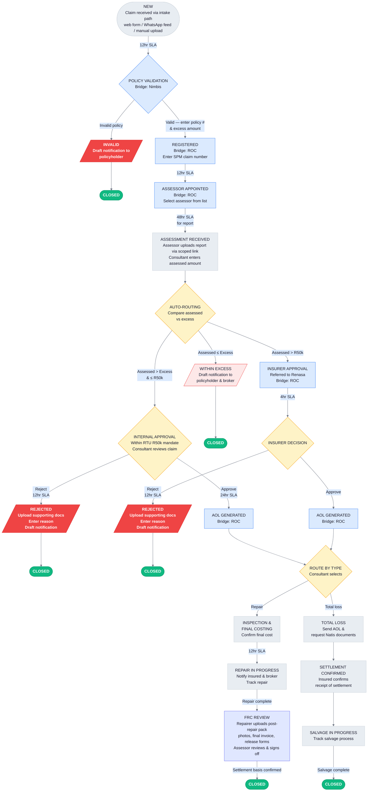
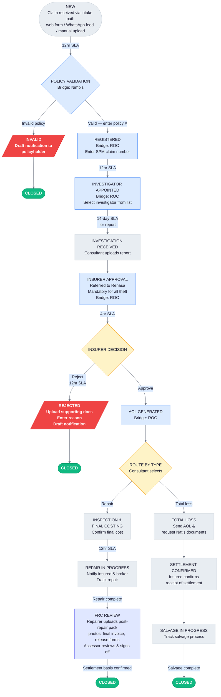
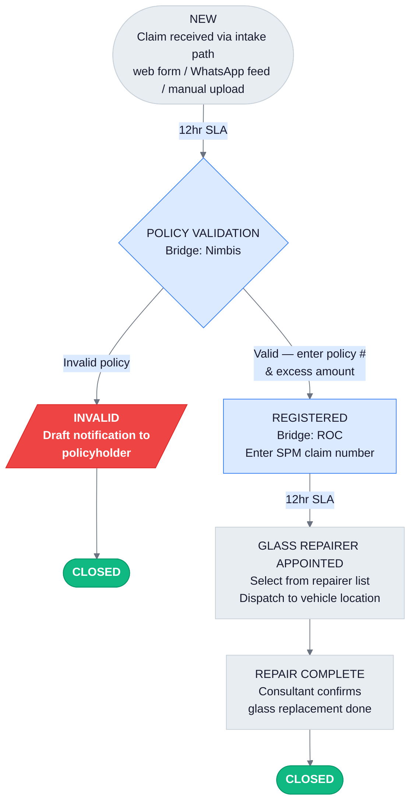

# ClaimPilot MVP -- Product requirements document (V3)

## RTU Insurance Services (RTUSA)

**Version:** 3.0
**Date:** 2026-04-10
**Author:** TrueAim.ai
**Status:** Draft
**Previous version:** V2.4 (2026-04-09), V2.2 (2026-03-28), V2.1 (2026-03-27), V2.0 (2026-03-27), V1 (2026-03-26)

### Change log

**V3.0 (2026-04-10)** — Workshop alignment (RTU × TrueAim prototype demo)

Summarises material decisions and gaps surfaced during the 2026-04-10 RTU/TrueAim workshop (Mike Mgodeli, Vassen Moodley, Matthew Rosenberg; TrueAim: Fred, Reuben, Alin). Full notes: `docs/RTUSA _ True Aim - Workshop - 2026_04_10 13_59 CEST - Notes by Gemini.md`.

- **New §7.6 "Claim conversation view" — scoped claims communications visibility.** Mike's requirement: replace Zoho as the claim-scoped view of communications so any consultant can pick up a claim cold, even on claims not assigned to them, and so inbound replies are captured for SLA measurement. **Scope is deliberately bounded: read-only ingestion of a shared `claims@rtusa.co.za` mailbox, threaded per claim by a ClaimPilot token in the subject line.** Gmail remains the mailbox. ClaimPilot does not compose or send in MVP. Compose-from-UI via Gmail API is Option B, deferred to §14. This addresses Mike's audit-trail requirement without becoming an email client or CRM replacement.
- **FRC (Final Repair Completion) step added — §5.6.11 and diagrams updated.** Vassen flagged this as missing from V2. Between REPAIR_IN_PROGRESS and CLOSED_REPAIR, a new joint review step captures post-repair photographs, final invoice, and release forms; the repairer submits, the assessor reviews, and the combined pack forms the basis for settlement. Applies to accident and theft workflows; glass is unaffected.
- **Parallel document gating model — new §5.9.** Replaces the prior (incorrect) "SLA pause when documents are missing" assumption. Per Mike: the claim cycle proceeds with missing non-material documents (assessment, repair authorisation, repair all continue), but **settlement is gated** until the full document pack is received. Rationale: a missing driver's licence shouldn't add 10 days to the repair cycle for a functional taxi. This is a parallel track with a payment gate, not a timer pause.
- **Document handling expanded — §4.2 updated.** Completeness checking flipped from "No" to "Yes, with manual override" (Reuben's framing, Mike agreed). Three capture points explicitly modelled: registration (claim form + supporting docs from policyholder), assessment (assessor report), FRC (post-repair pack). Documents are stored in ClaimPilot as the claim's system of record for audit years later — quoting Mike: *"Should we come here a year later and look after claim SPM543, we can go in and say: cool, documents, what documents do we have?"*
- **Scoped upload links for assessors and repairers — §3.2 and §5.6.4 updated.** Mike's proposal, Fred agreed feasible. When appointing an assessor, the system generates a tokenised no-login hyperlink scoped to that single claim. The assessor uploads the report directly into ClaimPilot through that link instead of replying by email. Same pattern for repairers at inspection/costing and FRC. Replaces V2's assumption that assessors interact only via email.
- **Intake paths broadened — §5.6.1 updated.** V2 assumed only manual operator upload. V3 documents three intake paths matching RTU's reality: (a) embedded TrueAim web form replacing the current Zoho hyperlink on rtusa.co.za; (b) WhatsApp bot feed — RTU's backend scrapes the existing WhatsApp-bot data and pushes structured claim records to ClaimPilot; (c) manual upload. All three land in the same claims@ shared address.
- **Per-claim touchpoint timeline view — §8 updated.** Mike requested a per-claim view showing each interaction touchpoint with duration, not just a stepper. Distinct from the dashboard's aggregated "average time per step."
- **Dashboard export — §9 updated.** Matthew requested PDF/CSV export of dashboard views for the weekly claims review meetings RTU currently builds manually offline.
- **Glass-first sandbox delivery plan — new §18.** Mike's proposal: start the next phase with a glass-claim sandbox (simplest workflow, highest volume at ~52% of claims). This includes an RTU-hosted web form replacing the Zoho glass claim capture, plus WhatsApp-bot data forwarding. Only after the glass sandbox validates the model do we extend to accident and theft.
- **SLA clock start timing clarified — §6.1 updated.** The SLA clock does not run in NEW state. It starts only when the claims consultant confirms the initial claim and advances to POLICY VALIDATION. This is a design choice shown in the prototype; now explicit in the spec.
- **Terminology: "Claims Consultant"** (confirmed by Vassen on call). Standardised throughout; "operator" retained only where it refers to the abstract workflow actor.
- **QA renamed to Insurer Approval — §5.1, §5.2 diagrams, §5.6.8, §5.5 comparison, §6.2 SLA table, §12 tenant config.** Per confirmation that QA APPOINTED/QA DECISION in V2 actually models the insurer (Renasa) approval step triggered when an accident claim exceeds RTU's R50k mandate, or unconditionally for theft claims. The step is now named INSURER APPROVAL / INSURER DECISION to match Vassen's language on the call: *"We've got a mandate for motor up to 50,000 rand. Within 50k we automatically give that approval; above 50k the insurer needs to provide approval."*

**V2.4 (2026-04-09)** — RTU working document alignment

- **System naming corrected throughout.** Nimbus → Nimbis, Rock → ROC to match RTU's actual system names.
- **SLA timings updated from RTU working document (section 6).** ROC submission: added 4-hour SLA (was bundled with policy validation). Internal approval: 24h → 4h. QA appointment: 6h → 4h. QA decision: 6h → 48h.
- **Within-excess auto-close (section 5.6.6).** Per Steve Cory's direction, claims within excess now auto-close with policyholder/broker notification — no operator confirmation required.
- **Radx parts benchmark preview (section 5.6.5).** Mock comparison of assessor quotes against Radx OEM pricing shown at assessment received step for accident claims. Read-only preview; functional integration deferred.
- **Seed data aligned to real RTU data patterns.** Claim type distribution (52% glass, 47% accident, <1% theft), real broker names, real vehicle models, realistic ZAR amounts.
- **SPM claim number promoted to primary identifier** in claim headers and list views.
- **New assumptions added for workshop validation (section 15).** Towing-triggered claims, fraud routing, broker entity model, Radx functional integration, reminder cadence model.

**V2.3 (2026-03-29)** — Prototype alignment and feature documentation

- **Claim type comparison table added (section 5.5).** Side-by-side matrix showing which workflow capabilities apply to each claim type (accident, theft, glass). Added to prevent future modelling errors where one flow is incorrectly assumed to mirror another.
- **Theft investigation received clarified (section 5.6.5).** Explicit statement that no financial data is entered at this step — operator uploads report only, claim auto-advances to QA. Previously the description was minimal and led to the theft flow being implemented as a copy of accident.
- **QA step differentiated by claim type (section 5.6.8).** QA serves different purposes depending on how the claim arrived: value-based threshold for accident, mandatory review for theft. Description updated to reflect both contexts.
- **Workflow fields table tightened (section 4.1).** Excess amount wording changed from "not applicable to theft" to "not collected for theft" to match implementation where the field is actively hidden, not just optional.
- **Step revert capability documented (section 5.7).** Operators can revert a claim to its previous workflow state from any active step. Revert re-activates the prior SLA timer, preserves all entered data and communications, and logs the action in the audit trail. Not available from NEW or CLOSED states.
- **Demo fast-forward clock documented (section 5.8).** Prototype-only feature that shifts all SLA timestamps to simulate the passage of time. Used during stakeholder demos to show SLA progression, approaching, and breach scenarios without waiting.
- **Communication templates expanded (section 7.3).** Detailed the 12 auto-generated draft email templates with trigger conditions, recipients, and content summaries. Added lifecycle description covering draft generation, copy-to-clipboard, and mark-as-sent workflow.

**V2.2 (2026-03-28)** — Theft workflow correction

- **Theft workflow: removed excess and internal approval paths.** Cross-referenced against the RTU Optimised Claims Flow spec diagram. The theft flow was incorrectly modelled as a copy of the accident flow with only the assessor/investigator step changed. In the spec, theft claims do not collect excess at policy validation, do not compare assessed amount vs excess, and do not route through internal approval. All theft claims go directly from investigation received to QA appointed, regardless of claim value, because theft claims are inherently higher risk and require QA oversight.
- **Sections updated:** 5.2 (theft diagram), 5.6.2 (policy validation), 5.6.5 (assessment/investigation received), 5.6.6 (within excess — now accident only), 5.6.7 (internal approval — now accident only), workflow fields table (excess and assessed amount scoped to accident), tenant config (approval threshold note).
- **Standalone diagram updated:** `docs/poc/diagrams/workflow-theft.mmd` rewritten to match.

---

## 1. Overview

### 1.1 What is ClaimPilot?

ClaimPilot is a multi-tenant SaaS workflow tool for insurance claims management. It gives claims consultants a single workspace to manage the claim lifecycle, track SLAs, generate draft communications, and monitor operations through a dashboard.

### 1.2 Context

RTU Insurance Services (RTUSA) is an underwriting management agency handling motor claims for taxis insured through Renasa. Their current process spans three disconnected systems (Zoho for CRM, Nimbis for policy admin, ROC for insurer claims admin) with claims tracked manually on Google Sheets. There is no workflow management, no SLA visibility, no automated communications, and no proactive follow-up with assessors, investigators, or repairers.

### 1.3 MVP objective

Replace the Google Sheets tracking with a workflow tool. ClaimPilot manages the claim lifecycle, enforces SLA tracking, generates draft communications, and gives management operational visibility. No integration to ROC, Nimbis, or other external systems in MVP.

### 1.4 Success criteria

- RTU can manage 100% of active claims within ClaimPilot
- Full visibility into claim status across all workflow stages
- SLA compliance is measurable and tracked per step
- Assessor/investigator/repairer follow-up is proactive via draft reminders
- Claim cycle time is measurable and reducible

---

## 2. Architecture principles

### 2.1 Multi-tenant SaaS

ClaimPilot is a multi-tenant platform. RTU is the first tenant. All tenant-specific configuration (SLA thresholds, approval limits, claim types, workflow steps) is scoped per tenant. The data model, authentication, and configuration layer support multi-tenancy from day one.

### 2.2 No external integrations (MVP)

ROC and Nimbis interactions are modelled as manual bridge steps. The system prompts the claims consultant to perform an action in the external system, provides the necessary data with copy buttons, and the consultant confirms completion and enters any return data (e.g. SPM claim number, policy number). Bridge steps are structured so they can be replaced with API calls later without changing the workflow.

### 2.3 Tech stack

- Frontend: React, Tailwind CSS, shadcn/ui
- Document extraction: Existing TrueAim extraction pipeline
- Background processing: Scheduler for SLA monitoring and reminder generation

---

## 3. Users and access

### 3.1 User roles (MVP)

A single role with full access for all RTU team members. No role-based permissions in MVP.

| User type | Access | Authentication |
|---|---|---|
| RTU Claims Consultant | Full access to all claims and features within their tenant | Email / password |
| RTU Management | Same full access; uses dashboard for oversight | Email / password |
| TrueAim Admin | Cross-tenant platform access | Email / password |

### 3.2 External parties (no login)

Assessors, investigators, repairers, policyholders, and brokers **do not log into ClaimPilot**. There are no user accounts for external parties and no authentication flow for them.

**Scoped upload links (new in V3):** Where external parties need to return documents or data to ClaimPilot — specifically assessors uploading assessment reports, repairers submitting FRC packs, and assessors signing off on FRC packs — the claims consultant dispatches a **tokenised no-login hyperlink** scoped to a single claim and a single action. The recipient opens the link, sees only the context for their assigned action (claim reference, vehicle summary, list of items to submit), uploads what's needed, and submits. No email back-and-forth, no attachments in inboxes, and the submission is automatically attached to the right claim.

**Token properties:**

- One token per (claim, external party, action) tuple
- Single-use or time-limited (configurable, default: 14 days)
- Links are sent as part of the draft email generated at the relevant workflow step
- Tokens cannot be used to view other claims or to perform any action not explicitly scoped
- Revocable by the claims consultant from the claim detail view
- Every upload is timestamped, logged in the audit trail, and attributed to the token's designated recipient

Policyholders and brokers do not currently receive scoped upload links in V3 MVP — they remain purely communication recipients (inbound through Gmail, outbound through draft emails).

---

## 4. Claim data model

### 4.1 Claim record

The claim record maps to the fields required by ROC for claim registration. Three claim form types exist (accident, theft, glass), each with different field requirements. Full field specs are in `docs/poc/specs/`.

#### Core fields (all claim types)

| Field | Source | Notes |
|---|---|---|
| Claim ID | System-generated | Internal ClaimPilot reference |
| Claim type | Extracted from claim form | Accident / Theft / Glass |
| Status | System-managed | Current workflow state |
| Assigned to | Auto-assigned | User who created the claim |
| Created at | System-generated | |
| Updated at | System-generated | |

#### Insured details (accident/theft)

| Field | Source | Required |
|---|---|---|
| Insured name (first/last/middle) | Extracted | Yes |
| Company name / surname and initials | Extracted | Yes |
| Company registration number | Extracted | No |
| VAT number | Extracted | No |
| Identity number | Extracted | Yes |
| Occupation or business | Extracted | Yes |
| Physical address | Extracted | No |
| Postal address | Extracted | No |
| Business contact number | Extracted | Yes |
| Home contact number | Extracted | No |
| Cell phone number | Extracted | Yes |

#### Insured details (glass)

| Field | Source | Required |
|---|---|---|
| Policy number | Extracted | Yes |
| Insured's contact number | Extracted | Yes |
| Email | Extracted | No |
| Address | Extracted | No |

#### Broker details

| Field | Source | Required |
|---|---|---|
| Broker name | Extracted | Yes (accident/theft) |
| Broker's email address | Extracted | No |
| Client's email address | Extracted | No |

#### Driver details

| Field | Source | Required |
|---|---|---|
| Driver name (first/last) | Extracted | Yes |
| Driver ID number | Extracted | Yes |
| Driver's contact number | Extracted | Yes (glass) |

Pre-filled from insured details by default. The claims consultant overrides if the driver is a different person.

#### Vehicle details

| Field | Source | Required (Acc/Theft) | Required (Glass) |
|---|---|---|---|
| Vehicle year, make and model | Extracted | Yes | Yes |
| Registration number | Extracted | Yes | Yes |
| Vehicle value (ZAR) | Extracted | Yes | No |
| Kilometres completed | Extracted | Yes | No |
| VIN | Extracted | Yes | Yes |
| Chassis number | Extracted | Yes | No |
| Engine number | Extracted | Yes | Yes |
| Exterior colour | Extracted | Yes | No |
| Interior colour | Extracted | Yes | No |

#### Finance details (accident/theft only)

| Field | Source | Required |
|---|---|---|
| Finance company | Extracted | No |
| Account number | Extracted | No |
| Outstanding amount (ZAR) | Extracted | No |
| Type of agreement | Extracted | Yes |

Captured for ROC registration. ClaimPilot does not act on finance details (no communications to finance companies, no settlement splitting). See Assumptions section.

#### Incident details

| Field | Source | Required (Acc/Theft) | Required (Glass) |
|---|---|---|---|
| Incident date and time | Extracted | Yes | Yes |
| Place / location | Extracted | Yes | Yes |
| Circumstances | Extracted | Yes | No |
| Police station reference number | Extracted | Yes | No |
| Date reported (to police) | Extracted | Yes | No |
| Vehicle locked? (reasons if not) | Extracted | No | No |
| Stolen accessories details | Extracted | No | No |
| Current vehicle location | Extracted | No | Yes |
| Cause of loss | Extracted | No | Yes (glass dropdown) |
| Which glass to be replaced | Extracted | No | Yes (glass dropdown) |

#### Workflow fields

| Field | Source | Notes |
|---|---|---|
| Policy number | Manual entry | Claims consultant enters after Nimbis lookup |
| SPM claim number (ROC) | Manual entry | Claims consultant enters after ROC registration |
| Excess amount | Manual entry | Claims consultant enters from policy on Nimbis (accident/glass only; not collected for theft — field is hidden) |
| Assessed amount | Manual entry | Claims consultant enters from assessor report (accident only; theft and glass do not enter an assessed amount) |
| Assessor / investigator | Selected from list | Name, contact details |
| Rejection reason | Manual entry | Free text, only on rejected claims |
| Rejection supporting documents | Manual upload | Required before rejection decision is finalized |

#### Anti-theft / recovery device (accident/theft only, optional)

| Field | Source |
|---|---|
| Device date | Extracted |
| Fitted by | Extracted |
| Device make | Extracted |
| Window markings number | Extracted |
| Applied by whom | Extracted |
| Scratches, dents, defects | Extracted |
| Other identifying features | Extracted |

#### Field editability

All fields are editable at any workflow stage. Every change is logged in the audit trail. If a field changes after ROC registration, the claims consultant is responsible for updating ROC manually (same as today).

### 4.2 Documents

Documents are uploaded, stored, and associated to the claim. ClaimPilot is the **system of record** for the full document pack — Mike on the workshop call: *"Should we come here a year later and look after claim SPM543, we can go in and say: cool, documents, what documents do we have? The claim form, the pictures, the assessor's report, the final amount. There's the full claim."* Each document has a type. Only the claim form is parsed for extraction in MVP.

**Required document matrix (per claim type):**

| Document type | Accident | Theft | Glass |
|---|---|---|---|
| Claim form | Required | Required | Required |
| Police report | Required | Required | Not required |
| Owner's ID | Required | Required | Not required |
| License disk | Required | Required | Not required |
| Vehicle registration document | Required | Required | Not required |
| Driver license | Required | Required | Required |
| Detailed trip log | Optional | Optional | Not required |
| Damage photos | Required | Required | Required |
| Assessor report | Required | — | — |
| Investigator report | — | Required | — |
| FRC post-repair photos | Required | Required | Not required |
| FRC final invoice | Required | Required | Not required |
| FRC release forms | Required | Required | Not required |

Final document requirements per claim type will be confirmed with RTU — the list above captures the consolidated set Mike and Vassen described on the 2026-04-10 call.

**Three capture points:**

1. **At registration** — claim form and its supporting documents are received with the initial intake (web form, WhatsApp bot scrape, or manual upload). Submitted by the policyholder or by the claims consultant on the policyholder's behalf.
2. **At assessment** — the assessor's report is uploaded by the assessor through their scoped upload link (§5.6.4).
3. **At FRC review** — the post-repair pack (photos, final invoice, release forms) is uploaded by the repairer through a scoped upload link, and signed off by the assessor through a second scoped upload link (§5.6.11).

**MVP capability:**

| Capability | MVP scope |
|---|---|
| Upload and store | Yes |
| Associate to claim with document type | Yes |
| Extract data from claim form | Yes |
| Extract data from supporting docs | No |
| Completeness checking | **Yes, with manual override** (see below) |
| Fraud detection | No (post-MVP) |

**Completeness checking and manual override:**

ClaimPilot maintains a per-claim-type checklist of required documents. At each capture point, the checklist shows which documents have been uploaded and which are outstanding. A document completeness indicator surfaces on the claim header and the work queue.

The claims consultant may **manually override** a missing document at any workflow step to proceed with the claim. Override is not blanket — it applies only to the step in question, and the missing documents remain on the checklist so the payment gate at §5.9 still applies. Every override is logged in the audit trail with the consultant's name and timestamp. This balances RTU's operational need to not block functional-vehicle repairs on non-material documents against the audit requirement that settlement not release until the full pack is complete.

### 4.3 Contacts: assessors, investigators, repairers

A tenant-level managed list of external parties with contact details (name, email, phone, type). Selected from a dropdown when appointing to a claim.

---

## 5. Claim lifecycle and workflow

### 5.1 Accident workflow

> Standalone diagram file: `docs/poc/diagrams/workflow-accident.mmd`

### 5.2 Theft workflow

> Standalone diagram file: `docs/poc/diagrams/workflow-theft.mmd`

Theft claims skip excess collection, excess-based auto-routing, and RTU internal approval. All theft claims go directly from investigation to insurer approval regardless of claim value, because theft claims are inherently higher risk and Renasa requires oversight on every one.

### 5.3 Glass workflow

> Standalone diagram file: `docs/poc/diagrams/workflow-glass.mmd`

Glass claims skip assessment, auto-routing, approval, total loss, and salvage. The glass replacement company is dispatched to the vehicle's current location.

### 5.5 Claim type comparison

The three claim types share a common workflow skeleton but differ significantly in which steps apply. This matrix summarises the differences to prevent one flow being incorrectly modelled as a copy of another.

| Capability | Accident | Theft | Glass |
|---|---|---|---|
| Excess collected at policy validation | Yes | **No** | Yes |
| Assessed amount entered | Yes (from assessor report) | **No** | No |
| Auto-routing (assessed vs excess) | Yes | **No** | No |
| Within Excess path | Yes | **No** | No |
| Internal Approval path (RTU mandate, ≤R50k) | Yes | **No** | No |
| Insurer Approval path (Renasa) | >R50k only | **All claims** (mandatory) | No |
| External party appointed | Assessor | Investigator | Glass repairer |
| Report SLA | 48h (assessor) | 14 days (investigator) | N/A |
| Repair / total loss routing | Yes | Yes | No |
| FRC review before settlement | Yes | Yes | No |
| Total loss / salvage path | Yes | Yes | No |
| Police reference required | Yes | Yes | No |
| Finance details captured | Yes | Yes | No |

### 5.6 Workflow step details

#### 5.6.1 NEW: claim creation

**Three intake paths** are supported, reflecting the reality of how RTU receives claims today (discussed with Mike on the 2026-04-10 call):

1. **Embedded web form:** RTU embeds a TrueAim-hosted claim form on rtusa.co.za, replacing the current Zoho hyperlink. The policyholder fills in the form on RTU's website; on submit, the form posts directly into ClaimPilot and creates a NEW claim record. This is the target intake path for the glass-first sandbox (§18).
2. **WhatsApp bot feed:** RTU's existing WhatsApp bot already captures the full claims journey (policy verification, vehicle details, damage photos). RTU's backend team scrapes the WhatsApp-bot output and pushes structured claim records to ClaimPilot via webhook. ClaimPilot does not build the WhatsApp integration itself — RTU owns the forwarding.
3. **Manual upload by claims consultant:** for intake paths that don't fit the above (email attachments, phone-in claims the consultant transcribes), the consultant uploads a claim form document and ClaimPilot's extraction pipeline populates the claim record.

All three paths land claims in the same NEW state. Regardless of intake path, the claim is not assigned and no SLA is running until a consultant confirms initial review and advances to POLICY VALIDATION.

**Per-path behaviour:**

- System: extract or receive claim form data, auto-populate claim record
- Claims consultant: review extracted/received data, correct errors, complete missing fields, confirm creation
- Auto-assignment: claim is assigned to the consultant who confirms it (for web form and WhatsApp paths, the shared claims@ inbox surfaces it as unassigned in the work queue until a consultant picks it up)
- Outcome: claim enters POLICY VALIDATION and the SLA clock starts

#### 5.6.2 Policy validation

- Type: manual bridge step (Nimbis)
- System: display policyholder and vehicle details with copy buttons for Nimbis lookup
- Claims consultant: check policy validity on Nimbis, return to ClaimPilot, enter policy number and excess amount (accident/glass only — theft claims do not collect excess), confirm valid or mark invalid
- SLA: configurable (default: 12 hours)
- Invalid path: status set to INVALID, draft notification to policyholder, claim closed

#### 5.6.3 Registered

- Type: manual bridge step (ROC)
- System: display claim data with copy buttons for ROC registration
- Claims consultant: register claim on ROC, enter SPM claim number into ClaimPilot, confirm
- SLA: included in the 12-hour policy validation SLA (combined step)
- Outcome: claim moves to assessor/investigator/repairer appointment

#### 5.6.4 Assessor / investigator / glass repairer appointed

- Type: manual bridge step (ROC, except glass repairer which is direct)
- System: display claim details, claims consultant selects external party from managed list
- Claims consultant: appoint on ROC (accident/theft) or contact directly (glass), confirm in ClaimPilot
- SLA for appointment: configurable (default: 12 hours from registration)
- SLA for report: configurable (default: 48 hours from appointment; glass: N/A)
- Reminders: draft email reminders at configurable intervals approaching and after SLA breach

**Scoped upload link dispatch (accident/theft):**

When the consultant confirms the appointment, ClaimPilot generates a scoped upload link (§3.2) for that specific assessor or investigator and inserts it into the auto-generated draft email. The recipient clicks the link, lands on a claim-scoped upload page (no login), sees the assigned action (*"Upload assessment report for SPM{ClaimID}"*), uploads the report, and submits. The submitted report is automatically attached to the claim, the workflow state advances to ASSESSMENT_RECEIVED / INVESTIGATION_RECEIVED, and the assigned claims consultant is notified.

If the assessor replies by email instead of using the link (transitional behaviour), the consultant can still upload the report manually from the claim detail view. The scoped link is the preferred path but not mandatory in MVP.

Glass repairers do not currently receive a scoped link — glass repair uses same-day dispatch and on-site replacement without a report submission step.

#### 5.6.5 Assessment / investigation received

**Accident claims:**
- Trigger: claims consultant enters assessed amount and uploads assessor report
- System auto-routing:
  - Assessed amount <= excess: WITHIN EXCESS (auto-close per V2.4)
  - Assessed amount > excess AND <= RTU mandate threshold (default R50,000): INTERNAL APPROVAL
  - Assessed amount > RTU mandate threshold: INSURER APPROVAL (referred to Renasa)

**Theft claims:**
- Trigger: claims consultant uploads investigator report and confirms receipt
- No financial data is entered at this step — theft claims do not have an assessed amount and do not undergo excess-based routing
- Routing: all theft claims advance directly to INSURER APPROVAL regardless of claim value (no excess check, no within-excess path, no internal approval path)

#### 5.6.6 Within excess (accident only)

- Applies to: accident claims only (theft claims skip excess routing entirely)
- System: draft notification to policyholder and broker (claim is within excess), claim auto-closes
- Outcome: claim closed

#### 5.6.7 Internal approval (accident only, within RTU mandate)

- Applies to: accident claims only, where the assessed amount is within RTU's R50k mandate (theft claims skip internal approval and go directly to insurer approval)
- Claims consultant: review and approve or reject within RTU mandate
- SLA: configurable (default: 4 hours)
- Approved: AOL generated on ROC (bridge step), then routes to repair or total loss (consultant selects)
- Rejected: consultant uploads supporting documents justifying rejection, enters rejection reason, system drafts notification to insured and broker, claim closed
- Rejection SLA: configurable (default: 12 hours from flagging potential rejection to final decision)

#### 5.6.8 Insurer approval (Renasa)

- Type: manual bridge step (ROC); claim is referred to Renasa for approval outside RTU's R50k mandate
- Consultant: submit claim to Renasa via ROC, confirm in ClaimPilot, await decision
- SLA (appointment/submission): configurable (default: 4 hours)
- SLA (decision): configurable (default: 48 hours)
- Reminders: draft reminders surfaced to the assigned claims consultant
- Approved: AOL generated on ROC (bridge step), then routes to repair or total loss
- Rejected: consultant uploads supporting documents justifying rejection, enters rejection reason, system drafts notification, claim closed (12-hour SLA)

**How claims reach insurer approval differs by type:**

- **Accident claims:** Only claims where the assessed amount exceeds the RTU mandate threshold (default R50,000, configurable) are referred to Renasa. Claims at or below the threshold go through internal approval instead (RTU self-approves within mandate). The insurer approval context shows the assessed and excess amounts that triggered the referral.
- **Theft claims:** All theft claims are referred to Renasa regardless of claim value. Theft claims are inherently higher risk and Renasa requires oversight on every one. The insurer approval context indicates that referral is mandatory for all theft claims (no amount comparison is shown, as theft claims do not collect excess or assessed amounts).

**Terminology note:** Earlier drafts (V2.x) referred to this step as "QA". Workshop feedback (2026-04-10) clarified that the step models insurer approval from Renasa, not a separate RTU QA function. The node has been renamed to INSURER APPROVAL / INSURER DECISION throughout the workflow diagrams and data model.

#### 5.6.9 Inspection and final costing

- Trigger: AOL generated and repair path selected
- System: notify repairer, start inspection
- Claims consultant: receives final costing from repairer/assessor, confirms
- SLA: configurable (default: 12 hours)
- Outcome: claim moves to REPAIR IN PROGRESS

#### 5.6.10 Repair in progress

- Applies to: accident and theft claims (glass has its own simpler repair path, see §5.6.15)
- Trigger: inspection and final costing confirmed
- System: start the repairer process, draft notification to insured and broker
- Claims consultant: tracks repair, marks complete when done
- SLA: configurable
- Reminders: draft reminders to repairer at configurable intervals
- Outcome: claim moves to FRC REVIEW (not directly to CLOSED)

#### 5.6.11 FRC Review (Final Repair Completion)

- Applies to: accident and theft claims only (glass is out of scope for FRC — see §5.6.15)
- Trigger: repairer marks the repair complete
- Purpose: validate the completed repair and assemble the document pack that forms the basis for settlement. Surfaced as a new workflow step in V3 after Vassen flagged it as missing from V2 on the 2026-04-10 workshop.

**Document pack (FRC pack):**

- Post-repair photographs of the vehicle
- Final repair invoice from the repairer
- Release forms (signed by insured and/or repairer confirming acceptance of the repair)
- Any other settlement-prerequisite documents configured per tenant

**Actors:**

- **Repairer:** uploads the post-repair pack through a scoped upload link (same tokenised no-login pattern as the assessor link, see §5.6.4). No ClaimPilot login required.
- **Assessor:** reviews the repairer's submission through a second scoped upload link. The assessor can either sign off on the pack or flag issues (request re-work, missing documentation, disputed items).
- **Claims consultant:** sees the FRC state in the work queue, can chase either party via draft reminder emails, confirms sign-off into ClaimPilot once both parties have submitted.

**SLA:**

- Repairer pack submission: configurable (default: TBD — pending RTU confirmation)
- Assessor review decision: configurable (default: TBD — pending RTU confirmation)
- Reminders follow the standard approaching/breach pattern

**Outcomes:**

- **Signed off:** the claim's document completeness check is satisfied for the settlement gate (see §5.9). Claim advances to CLOSED_REPAIR. Settlement on ROC is the separate downstream process (see §5.6.14).
- **Issue flagged:** the claim reverts to REPAIR_IN_PROGRESS with an audit trail entry describing the flagged issue. Repairer is notified via draft email.

**Settlement on ROC:**

Per Mike on the workshop call, actual settlement payment happens on ROC, not in ClaimPilot. ClaimPilot either: (a) closes the claim when the consultant confirms settlement happened, or (b) closes the claim automatically when a ROC status report indicates settlement (future ROC integration). This is out of scope for MVP beyond the manual-confirm path.

#### 5.6.12 Total loss

- Trigger: AOL generated and total loss path selected
- System: send AOL and draft request for Natis documents to insured and broker
- Claims consultant: confirms Natis documents received, confirms settlement issued
- Outcome: moves to SETTLEMENT CONFIRMED

#### 5.6.13 Settlement confirmed

- Trigger: claims consultant confirms settlement issued
- System: draft settlement notification to insured and broker
- Claims consultant: awaits confirmation of receipt from insured
- Outcome: once receipt confirmed, moves to SALVAGE IN PROGRESS

#### 5.6.14 Salvage in progress

- Trigger: settlement receipt confirmed
- Claims consultant: tracks salvage, marks complete when done
- SLA: configurable
- Reminders: draft reminders at configurable intervals
- Outcome: claim closed

#### 5.6.15 Glass repair complete

- Trigger: glass repairer confirms replacement done
- Claims consultant: marks repair complete in ClaimPilot
- Outcome: claim closed (no FRC review — glass is a same-day replacement with no settlement basis to validate)

### 5.7 Step revert

Claims consultants can revert a claim to its previous workflow state from any active step. This supports corrections when a claim was advanced prematurely or when new information requires revisiting a prior step.

**Behaviour:**

- A "Back to [Previous Step]" button appears on the action panel for all claims not in NEW or CLOSED state
- Clicking the button requires confirmation before the revert executes
- The claim's status returns to the previous state as determined by its SLA history (the most recently completed state)
- The current step's active SLA record is removed
- The previous step's SLA record is re-opened (completion timestamp cleared), so the SLA timer resumes from where it was
- All workflow field data entered during the reverted step is preserved — no data is lost
- All draft communications generated during the reverted step are preserved
- An audit trail entry is logged: "Status reverted from [Current] to [Previous]"
- The revert follows the claim's actual path through the workflow, not a generic state machine order

**Constraints:**

- Cannot revert from NEW (no previous state exists)
- Cannot revert from CLOSED (terminal state)
- Revert is a single-step operation — to go back multiple steps, the consultant must revert repeatedly

### 5.8 Demo fast-forward clock (prototype only)

The prototype includes a time simulation feature for stakeholder demos. This feature will not be present in the production MVP.

**Behaviour:**

- A row of buttons on the claims list page allows advancing the simulated clock: +1h, +3h, +6h, +12h, +24h, +7d
- Clicking a button shifts all SLA timestamps (entered, due, completed) backward by the selected duration across all claims
- This makes the SLA engine calculate higher elapsed percentages, simulating the passage of time
- Used to demonstrate SLA progression from "within" to "approaching" to "breached" without waiting
- A toast notification confirms: "Clock advanced by Xh"

**Scope:** Global — affects all claims simultaneously. Does not change claim states or trigger any workflow transitions.

### 5.9 Parallel document gating (settlement gate model)

**Problem:** RTU sometimes receives a claim with mandatory documents missing (e.g. driver's licence, trip log). In V2, the assumption was that the SLA clock should pause until the missing documents arrive. That assumption is wrong — it was corrected on the 2026-04-10 workshop call by Mike and Vassen.

**The real model:** missing non-material documents must **not** block the claim cycle. The assessment, repair authorisation, and repair can all proceed in parallel while ClaimPilot chases the outstanding documents. What they block is **settlement** — RTU will not release payment until the full document pack is complete. This keeps functional taxis earning revenue during repair, which is RTU's core commercial objective.

Quoting Mike: *"We haven't stopped the claim cycle from taking off. However, we're never going to settle the claim until all the documentation is done. What happened in the past is that I'm going to wait 3 days to appoint the assessor because I'm waiting for the driver's licence. Then 3 days later I start the assessment process. That takes me two days. Then I'm waiting for one more document... So I've lost 10 days on the repair cycle because of a driver's licence that was missing, which is not really material to the claim."*

**How ClaimPilot models it:**

- **Document completeness** is tracked independently of **workflow state**. A claim can be in REPAIR_IN_PROGRESS with documents still outstanding.
- **SLA clocks run normally.** There is no pause-and-resume model. The assessment SLA, internal/insurer approval SLA, repair SLA, etc. all run on their normal timelines regardless of document completeness.
- **A settlement gate blocks closure.** The claim cannot leave FRC_REVIEW into CLOSED_REPAIR, or leave SETTLEMENT_CONFIRMED into SALVAGE_IN_PROGRESS, until the document completeness check is green (either because all required docs are uploaded, or because a consultant has explicitly overridden each missing item per §4.2).
- **A separate document-chase SLA runs in parallel** for each outstanding required document, starting from the moment the claim reaches the step where that document is expected. These chase SLAs drive the reminder engine so the consultant keeps pressure on the policyholder/assessor/repairer to supply missing items.
- **The dashboard surfaces "claims with outstanding documents"** as a separate operational view — orthogonal to the SLA dashboard — so management can see which claims are on the settlement gate.

**Explicit non-goals:**

- No pause-and-resume of workflow SLAs based on document state
- No blanket bypass that marks a claim complete with missing documents
- No silent overrides — every override is logged in the audit trail per §4.2

---

## 6. SLA engine

### 6.1 Design

A background scheduler monitors all active claims against their current workflow step's SLA deadline. Deadlines are calculated from the timestamp of entry into each workflow state, measured in calendar hours (7 days/week, no business-hours exceptions).

**Clock-start rule:** the SLA clock **does not run while a claim is in NEW state**. A claim can sit in NEW indefinitely — for example, if a claim form has been received from the embedded web form or WhatsApp bot feed but no claims consultant has picked it up yet. The SLA clock starts only when a consultant confirms the initial claim and advances the workflow to POLICY VALIDATION. This design was shown in the 2026-04-10 prototype and is now explicit: *"No SLA kicks in until an agent confirms the initial claim registration and proceeds with policy validation"*.

The dashboard separately tracks **time in NEW state** (intake-queue latency) so management can spot claims that have landed in the shared inbox but not yet been picked up by a consultant. This is not an SLA breach — it's an operational metric.

### 6.2 Configuration

Per-tenant configurable values:

| Workflow step | Default SLA | Configurable |
|---|---|---|
| Policy validation | 12 hours | Yes |
| ROC submission (registration) | 4 hours | Yes |
| Assessor/investigator appointment | 12 hours | Yes |
| Assessor report | 48 hours | Yes |
| Investigator report | 14 days (336 hours) | Yes |
| Internal approval decision (within R50k mandate) | 4 hours | Yes |
| Insurer approval submission (Renasa referral) | 4 hours | Yes |
| Insurer approval decision | 48 hours | Yes |
| Rejection process (flag to decision) | 12 hours | Yes |
| Inspection and final costing | 12 hours | Yes |
| Repair completion | TBD | Yes |
| FRC repairer pack submission | TBD | Yes |
| FRC assessor sign-off | TBD | Yes |
| Salvage completion | TBD | Yes |
| Glass repair completion | TBD | Yes |
| Document chase (per outstanding required document, see §5.9) | 24 hours | Yes |

### 6.3 SLA states

Each active claim has one of three SLA states:

- **Within SLA:** less than 75% of SLA elapsed
- **Approaching:** 75-99% of SLA elapsed
- **Breached:** 100% or more elapsed

### 6.4 Reminder schedule

Configurable reminder intervals per SLA. Default pattern:

- Warning at 75% of SLA elapsed
- Urgent at 90% of SLA elapsed
- Breached at 100%
- Escalation reminders at configurable intervals after breach

Each trigger generates a draft email to the relevant external party and surfaces an action item to the assigned claims consultant.

---

## 7. Communications

### 7.1 Draft email generation

At workflow milestones, the system generates a draft email pre-populated with claim context. All communications are in English. TrueAim writes the initial templates; RTU reviews and approves during the live testing phase. Templates are static in MVP (no tenant-editable template editor).

### 7.2 Draft email lifecycle

Each draft follows a four-stage lifecycle:

1. **Auto-generated.** When the claim advances to a state with a communication trigger (see 7.3), the system creates a draft pre-populated with claim context. A stable thread token in the form `[CP-{ClaimID}]` is inserted into the Subject line — this token is how inbound replies are threaded back to the claim (see §7.6). The draft appears as a pending bubble in the claim's conversation view. An audit trail entry records the generation.
2. **Review.** The claims consultant opens the draft from the Conversation tab on the claim detail page. A modal displays the From / To / Bcc / Subject / Body fields in a read-only email-style layout. `BCC: claims@rtusa.co.za` is pre-populated and visible.
3. **Open in Gmail.** The consultant clicks "Open in Gmail." Gmail web opens in a new browser tab with all fields prefilled including the BCC. The consultant sends from Gmail.
4. **Ingestion-driven sent state.** ClaimPilot's ingestion worker (polling the shared mailbox) sees the sent message and flips the draft's state from `pending` to `sent` in the claim's conversation view. The consultant never clicks a "Mark as sent" button — the state transition is always driven by ingestion seeing the message land in `claims@`.

**There is no "Mark as sent" click in ClaimPilot.** The button was removed in V3 because it was duplicated ceremony — ingestion already knows. The conversation view is the single source of truth for message state.

No email integration or auto-send in MVP. The consultant sends all emails manually from Gmail. See §14 for the deferred "Option B" Gmail API send path.

### 7.3 Communication triggers and templates

The system generates draft emails at the following workflow transitions. Each template includes claim-specific data (claim ID, vehicle details, insured name, incident circumstances) drawn from the claim record at the time of generation.

| # | Trigger state | Template | Recipient | Subject pattern | Content summary |
|---|---|---|---|---|---|
| 1 | ASSESSOR_APPOINTED | assessor_appointed | Appointed assessor | "Assessment Required — {ClaimID} \| {Vehicle}" | Claim details, vehicle info, incident description, insured contact, report deadline |
| 2 | INVESTIGATOR_APPOINTED | investigator_appointed | Appointed investigator | "Investigation Required — {ClaimID} \| {Vehicle}" | Vehicle theft details, police reference, insured contact, 14-day report deadline |
| 3 | GLASS_REPAIRER_APPOINTED | glass_repairer_appointed | Appointed glass repairer | "Glass Replacement Required — {ClaimID} \| {Vehicle}" | Vehicle location, glass type, insured contact details |
| 4 | WITHIN_EXCESS | within_excess | Insured (policyholder) | "Claim {ClaimID} — Within Excess Notification" | Assessed amount vs excess amount, explanation that no further action will be taken |
| 5 | REPAIR_IN_PROGRESS | repair_started | Insured (policyholder) | "Claim {ClaimID} — Repair Commenced" | Cost authorization confirmed, repair notification |
| 6 | TOTAL_LOSS | claim_approved_total_loss | Insured (policyholder) | "Claim {ClaimID} — Total Loss Notification" | AOL notification, request for Natis documents for settlement processing |
| 7 | SETTLEMENT_CONFIRMED | settlement_issued | Insured (policyholder) | "Claim {ClaimID} — Settlement Notification" | Settlement amount, request for confirmation of receipt |
| 8 | REJECTED | claim_rejected | Insured (policyholder) | "Claim {ClaimID} — Claim Declined" | Rejection reason, 30-day dispute window |
| 9 | INVALID | invalid_policy | Insured (policyholder) | "Claim {ClaimID} — Invalid Policy" | Policy validation failure, instruction to contact broker |
| 10 | (SLA approaching) | sla_warning | Assigned contact | "REMINDER: {ClaimID} — Action Required" | SLA urgency warning, time remaining |
| 11 | (Post-repair) | repair_follow_up | Repairer | "Status Update Request — {ClaimID}" | Request for repair progress update |

All templates are authored in English by TrueAim. RTU reviews and approves during the live testing phase. Templates are static in MVP (no tenant-editable template editor).

### 7.4 Template data fields

Each template pulls from the claim record at generation time:

- **Claim context:** Claim ID, claim type, workflow state
- **Vehicle:** Year, make, model, registration number
- **Insured:** Name, contact details
- **Incident:** Date, location, circumstances, police reference (accident/theft)
- **Financial:** Assessed amount, excess amount (where applicable to claim type)
- **Contact:** Appointed assessor/investigator/repairer name and email
- **Formatted amounts:** South African Rand formatting (R 0,000.00)

### 7.5 Broker handling

Brokers are a secondary contact on the claim record. Wherever draft notifications are generated to the policyholder, a copy is drafted for the broker.

### 7.6 Claim conversation view (scoped comms visibility)

**Purpose.** Give every claims consultant a unified view of the full communication trail for any claim they open — so any consultant can pick up a cold claim and answer a customer follow-up without hunting through multiple mailboxes, and so SLA measurement has visibility into inbound replies from external parties.

**Not in scope.** ClaimPilot is deliberately **not** an email client, not an inbox, and not a CRM replacement. The conversation view is **read-only ingestion and display**. There is no compose-from-scratch, no reply-from-UI, no unread/read state management, no labels, no folders, no signatures, no attachments beyond what's already on the claim, no cross-claim mailbox browsing. Gmail remains the mailbox for both sending and receiving.

Quoting Mike on the requirement: *"If a client calls in following up on a claim and Vas is not there and I'm handling it, they're going to say 'hey I sent you this thing weeks ago' — and I must go get an audit trail of when the coms were going on. If I can quickly get your ID number, I can search and say 'dude, the mail was sent to you last week, you haven't responded, what's your story?' It's in one place."* That requirement is fully served by read-only per-claim visibility. Nothing in the workshop demands a send-from-UI or compose surface in MVP.

**How threading works.**

1. RTU sets up (or nominates an existing) shared mailbox at `claims@rtusa.co.za`.
2. When ClaimPilot generates any draft email at a workflow trigger (see §7.3), the Subject includes a stable thread token of the form `[CP-{ClaimID}]` — for example `[CP-SPM12345]`. Consultants must not edit or strip this token.
3. Consultants send from their personal Gmail (as today), BCC'ing `claims@rtusa.co.za`. External recipients reply-all to the same subject line, which preserves the token.
4. A ClaimPilot ingestion worker polls the shared mailbox (Gmail API or IMAP; exact mechanism to be confirmed in the comms follow-up session owned by Reuben).
5. For each message found, the worker parses the Subject for a `[CP-*]` token, looks up the matching claim, and attaches the message (sender, recipient, timestamp, body, attachments) to that claim's conversation record.
6. Inbound messages without a recognisable token land in an **"unmatched" tray** visible in the work queue, where a consultant can manually assign them to a claim (or mark them as not claim-related, which removes them from the tray).

**Per-claim conversation UI.**

- A Communications tab on the claim detail page shows a chronological thread view: oldest at top, newest at bottom, each message showing sender, recipient(s), timestamp, subject, body, and any attachments.
- Drafts generated by ClaimPilot (§7.1–7.4) appear inline with ingested messages so the full trail — draft generated, sent externally, replied to, chased — is visible in one place.
- Attachments on inbound messages are automatically stored as claim documents (typed as "correspondence attachment" by default; the consultant can retype if appropriate, e.g. assessor's report).
- A "latest inbound from [party]" indicator surfaces in the claim header so the consultant can see at a glance whether the policyholder/assessor/repairer has responded.
- The conversation view is searchable within the claim only. There is no cross-claim conversation search in MVP.

**Access model.**

- All claims consultants can view the conversation thread on any claim, even claims not assigned to them. This is the primary requirement: any consultant picks up any claim and has full context.
- The conversation view is read-only for consultants — they cannot edit or delete messages. Messages can be hidden from view (soft-delete) only via a specific admin action, logged in the audit trail.
- External parties (assessors, repairers, policyholders, brokers) have no access to the conversation view. They see only the emails they receive in their own inboxes.

**SLA measurement.**

- When an inbound reply from an external party is attached to a claim, ClaimPilot timestamps the inbound and updates a "last inbound from {party}" field.
- This field is used by the reminder engine: if the consultant is chasing an assessor for a report and a reply arrives, the reminder escalation pauses automatically until the consultant acts on the reply.
- This is the mechanism that satisfies Mike's concern: *"if I only see outbound, I can't measure that... they're going to say 'I sent the email to this person' and we can't track that"*.

**Integration with §7.2 draft lifecycle.**

- The consultant reviews drafts generated at workflow triggers, but the handoff to Gmail is explicit (Open in Gmail) and the sent-state transition is driven by ingestion, not by a consultant click.
- The conversation view is the single source of truth for message state — nothing in the UI can mark a message as sent independently of what the ingestion worker sees.
- The Gmail compose URL pre-populates `BCC: claims@rtusa.co.za` — consultants only need to not remove it for the ingestion worker to capture the outbound message. ClaimPilot does not enforce this at MVP (see assumption #25 in §15).

**MVP scope summary for §7.6:**

| Capability | In MVP |
|---|---|
| Shared claims@ mailbox ingestion | **Yes** |
| `[CP-{ClaimID}]` Subject token threading | **Yes** |
| Per-claim chronological thread view | **Yes** |
| Read-only conversation visible to all consultants | **Yes** |
| Unmatched-inbound tray for manual assignment | **Yes** |
| Inbound attachments auto-attached to claim | **Yes** |
| Last-inbound-from-party indicator | **Yes** |
| Auto-pause reminders on inbound reply | **Yes** |
| Draft lifecycle is ingestion-driven, not click-driven | **Yes** |
| Compose-from-UI | No — deferred (see §14, Option B) |
| Send-from-UI via Gmail API | No — deferred (see §14, Option B) |
| Reply button on inbound messages | No — deferred |
| Cross-claim mailbox browsing | No — would be CRM creep |
| Unread/read state, labels, folders | No — ClaimPilot is not an inbox |
| Email search across non-claim messages | No |
| Tenant-editable templates | No (see §13) |
| Attachment composition | No |
| Signatures / out-of-office handling | No — lives in Gmail |

**Open items** (to be resolved in the Reuben-owned comms follow-up session — see §17):

- Exact ingestion mechanism (Gmail API pull vs IMAP poll vs Google Workspace webhook)
- BCC vs Send-As vs explicit forwarding rule as the capture mechanism
- Retention of non-claim-related unmatched inbound (auto-delete after N days?)
- Handling of personal information in ingested messages (redaction? retention limits?)
- Draft generation triggers and metrics (Reuben committed on the call to a dedicated session on this)

---

## 8. Claim list and work queue

### 8.1 Primary consultant view

The claim list is a filterable table and the main claims consultant workspace. It is the default view after login.

### 8.2 "My queue" toggle

A toggle filters the table to the logged-in consultant's assigned claims, sorted by urgency:
1. Breached SLA (most overdue first)
2. Approaching SLA (closest to breach first)
3. Within SLA (oldest first)

### 8.3 Filters

- Status (workflow state)
- Claim type (accident / theft / glass)
- Assignee
- SLA status (within / approaching / breached)
- Document completeness (complete / outstanding documents — per §5.9)
- Date range (created, updated)

### 8.4 Search

Free-text search across: policy number, vehicle registration, policyholder name, SPM claim number, claim ID.

### 8.5 Table columns

Claim ID, claim type, policyholder name, vehicle registration, status, SLA status (color-coded), time remaining/overdue, assigned to, created date, last updated.

### 8.6 Per-claim touchpoint timeline (new in V3)

Separate from the workflow stepper, each claim has a **touchpoint timeline view** on the claim detail page showing every interaction point on the claim with its duration. This addresses Mike's request on the 2026-04-10 workshop: *"If I've got a claim to say 'guys, this claim had 10 interactions, each point of these interactions took so long, this is how long the claim took from start to finish' — that would be quite useful."*

**What the timeline shows:**

- Each workflow state entry/exit pair with time-in-state
- Each outbound draft generation → mark-as-sent → inbound reply cycle with response time
- Each document capture event (registration, assessment, FRC)
- Each scoped upload link dispatch → submission with response time
- Each SLA warning / breach / resolution event
- Each manual override applied (§4.2, §5.9)

**Display:**

- Chronological, oldest to newest
- Each entry shows: timestamp, actor (system / consultant name / external party name), event type, duration since previous touchpoint, absolute elapsed from claim creation
- Filterable by event type (state transitions only / communications only / documents only / everything)
- Exportable per-claim as CSV (feeds the dashboard export in §9.3)

This is not redundant with §9 Dashboard metrics — the dashboard aggregates across claims, the timeline shows one claim's full interaction history.

---

## 9. Operational dashboard

### 9.1 Scope

Workflow and operational metrics only. No claims analytics (cost trending, leakage detection, parts analysis) in MVP.

### 9.2 Dashboard views

**Claims overview:**
- Total active claims by status (count per workflow state)
- New claims today / this week / this month
- Claims closed today / this week / this month

**SLA performance:**
- Claims within SLA vs. approaching vs. breached (per workflow step)
- SLA compliance rate by step (percentage within SLA)
- Breached claims list sorted by most overdue first

**Assessor / investigator performance:**
- Report turnaround time per assessor
- SLA compliance rate per assessor
- Active assignments per assessor

**Consultant workload:**
- Active claims per consultant
- Overdue actions per consultant

**Time to close:**
- Average time from creation to close (overall and by claim type)
- Average time per workflow step

**Intake queue (new in V3):**
- Claims in NEW state (not yet picked up by a consultant) with time-in-NEW
- Count of unmatched inbound messages in the conversation tray (§7.6)

**Document outstanding (new in V3, per §5.9):**
- Claims with outstanding required documents, grouped by workflow state
- Claims on the settlement gate (cannot close due to document completeness check failing)
- Oldest outstanding document per claim

### 9.3 Dashboard export (new in V3)

Matthew requested on the 2026-04-10 workshop call: *"There's going to be weekly meetings to review claims progression, especially claims type and how that's evolving, claims volume and so on. So to be able to present it as part of a deck in those review meetings would be helpful."* RTU currently builds these reports manually offline.

**Scope:**

- **PDF export** of any dashboard view, preserving charts and tables, titled with the tenant name, date range, and export timestamp
- **CSV export** of the underlying data for any view that has tabular data (claims lists, per-assessor performance, per-consultant workload)
- **Date range selection** on export: today / this week / this month / this quarter / this year / custom range
- **All views export independently**; there is no bundled "export everything" at launch

The export button appears on every dashboard view header. Exports run synchronously for small date ranges and async (with in-app notification when ready) for large ranges.

**Not in scope for MVP:**

- Scheduled/recurring exports (post-MVP)
- Emailed exports (post-MVP)
- Custom report builder (post-MVP)
- White-labelled exports with tenant logo (post-MVP)

---

## 10. Audit trail

Every action on a claim is logged with:

- Timestamp
- User who performed the action
- Action type (status change, field edit, document upload, assignment, communication sent)
- Previous value and new value (for field changes)
- Previous status and new status (for state transitions)

The audit trail is viewable per claim as a chronological activity log.

---

## 11. Document extraction

### 11.1 Extraction by form type

When a claim form is received (via one of the three intake paths in §5.6.1), ClaimPilot runs it through the extraction pipeline. Extraction targets differ by form type.

**Accident and theft forms (54-61 fields):**
- Insured details: name, company name, ID number, contact numbers, addresses
- Vehicle details: make/model/year, registration, VIN, chassis, engine number, colours, value, km
- Driver details: name, ID
- Incident details: date/time, place, circumstances, police reference
- Finance details: company, account number, outstanding amount
- Broker details: name, email

**Glass form (21 fields):**
- Policy number
- Vehicle details: description, registration, VIN, engine number
- Loss details: date, time, place, cause, glass to replace
- Contact details: insured phone, driver phone, driver ID
- Current vehicle location

### 11.2 Extraction review

The claims consultant reviews extracted data on a confirmation screen, corrects errors, and completes fields that come from other sources (excess amount, policy number from Nimbis, SPM number from ROC). Extraction populates what it can; the consultant fills the rest.

### 11.3 Extraction failures

If extraction fails to parse a field, it is left blank. The claims consultant fills it manually. If extraction fails entirely, the consultant enters all fields manually. No separate "manual entry mode" — the same confirmation screen is used with empty fields.

---

## 12. Tenant configuration

Per-tenant settings managed by TrueAim admin (and eventually by tenant admins):

| Setting | Default | Notes |
|---|---|---|
| RTU mandate threshold | R50,000 | Accident claims ≤ threshold go through RTU internal approval; accident claims > threshold are referred to insurer (Renasa) approval. All theft claims are referred to insurer approval regardless of threshold. |
| SLA per workflow step | See Section 6.2 | Calendar hours |
| Reminder intervals | See Section 6.4 | Per SLA step |
| Claim types | Accident, Theft, Glass | Selectable on claim creation |
| Assessor / investigator / repairer list | Managed per tenant | Name, email, phone, type |
| **Mandatory document checklist per claim type** | See §4.2 | Drives the completeness check and the §5.9 settlement gate. Per-document: required/optional, capture point (registration / assessment / FRC), chase SLA, and whether a consultant override is permitted. |
| **Shared claims mailbox address** | `claims@rtusa.co.za` (TBC) | The address the §7.6 ingestion worker polls. Per-tenant. |
| **Scoped upload link TTL** | 14 days | Tokenised no-login link lifetime (§3.2) |
| **Scoped upload link single-use** | False | If true, each link can only be used once; if false, link is valid for TTL duration. Per-action configurable. |
| **FRC document pack composition** | Post-repair photos, final invoice, release forms | The required items the repairer uploads + the assessor signs off on at §5.6.11. Pending RTU confirmation. |
| **Draft generation triggers** | See §7.3 | Pending the comms follow-up session outputs |
| **Insurer entity** | Renasa | The insurer referred to for claims above the RTU mandate |

---

## 13. Scope exclusions (MVP)

| Item | Status | Notes |
|---|---|---|
| ROC integration | Out | Manual bridge steps only |
| Nimbis integration | Out | Manual bridge steps only |
| Zoho (email/CRM) | **Replaced, not integrated with** | Zoho was the claim-scoped view over Gmail; §7.6 now serves that purpose. No API integration with Zoho. |
| WhatsApp bot integration (TrueAim-built) | Out | RTU's backend scrapes the existing WhatsApp bot output and pushes to ClaimPilot; TrueAim does not build the WhatsApp side |
| RTU Assist / towing trigger | Deferred | Pre-populated claim forms from RTU Assist exist but excluded from MVP |
| Incomplete claim form holding state | Out | Superseded by §5.9 parallel document gating — the claim cycle proceeds with missing non-material docs; settlement is gated |
| Radics / parts sourcing | Out | No automated parts lookup (Radx benchmark preview per V2.4 is read-only display) |
| AOL document generation | Out | Tracked as manual step on ROC |
| Fraud detection | Out | Post-MVP |
| ~~Document completeness checking~~ | **In (§4.2)** | ~~Out / Human responsibility~~ — **V3: now in-scope with manual override** |
| Claims analytics (cost trending, leakage) | Out | Post-MVP |
| Multi-vehicle / third-party claims | Out | One claim = one vehicle |
| Policyholder-facing portal | Out | No external user access |
| Role-based permissions | Out | Full access for all users |
| SSO | Out | Email/password auth |
| Compose / send email from ClaimPilot | **Out (Option B deferred)** | ClaimPilot generates drafts and hands the consultant off to Gmail via a prefilled compose URL. Sent state is driven by ingestion seeing the BCC'd message, not by a ClaimPilot click. Gmail API send is the "Option B" deferred path, see §14. |
| Cross-claim mailbox / inbox view | **Out (structural)** | ClaimPilot is not an email client. Conversation view is scoped per-claim only. |
| Broker portal or distinct broker role | Out | Broker = secondary contact |
| Claim reopening | Out | Closed is terminal in MVP |
| Editable email templates | Out | Static templates, TrueAim-authored |
| Data migration from Google Sheets | Out | Clean cut-over (see Section 16) |

---

## 14. Future considerations (post-MVP)

Not built in MVP, but the data model and workflow structure support adding them later:

- **Comms Option B — Gmail API send-from-UI.** The natural next step after §7.6's read-only ingestion. Add a "Send via Gmail" button on the draft modal that uses the consultant's OAuth token to send the email from their Gmail account, with the `[CP-{ClaimID}]` token pre-inserted so the reply is captured by the ingestion worker. Keep compose-from-scratch and inbox browsing out — it's still not a mailbox. Trade-off to accept when upgrading: per-user OAuth complexity, Gmail API rate limits, bounce/delivery handling.
- **ROC API integration:** replace bridge steps with direct API calls; also enables auto-close on ROC settlement status change per §5.6.11.
- **Nimbis API integration:** automate policy validation once API is available
- **Fraud detection:** add fraud analysis on top of existing document storage and extraction
- **Parts sourcing / Radx integration (functional):** move beyond read-only benchmark preview to actionable cost intervention (reject/renegotiate quotes against benchmark)
- **Role-based permissions:** add roles to existing user model (consultant / team lead / admin separation)
- **Claims analytics dashboard:** build on audit trail and structured data (cost trending, leakage detection)
- **Policyholder self-service portal:** expose claim status through external read-only access
- **Scoped upload links for policyholders:** extend the §3.2 tokenised link pattern to policyholders so they can upload missing supporting documents without email back-and-forth
- **Assessor portal / repairer portal:** proper authenticated UI for external parties (only if the scoped-link MVP pattern proves insufficient)
- **Claim reopening:** allow re-entry to specific workflow states
- **Editable email templates:** let tenants customize templates through config
- **Finance company communications:** act on finance details already captured
- **Scheduled dashboard exports** (email the weekly review pack automatically)
- **Cross-claim conversation search** (if Mike asks for it after using read-only per-claim view)

---

## 15. Assumptions to confirm with RTU

These decisions were made during scoping. Workshop resolutions from 2026-04-10 are folded in; items that were closed on the call are marked ✅. Open items carry forward.

| # | Assumption | If wrong | Status |
|---|---|---|---|
| 1 | All required Zoho form fields are required by ROC for claim registration | Need a separate ROC field mapping; some form fields may be optional | Open |
| 2 | Driver and insured are usually the same person for taxi claims | May need a more prominent driver entity and separate driver management | Open |
| 3 | Finance details are captured for ROC but ClaimPilot does not act on them (no finance company communications) | Need finance company as a communication recipient on the total loss path | Open |
| 4 | Glass claims: registered on ROC, no assessor via ROC, no total loss path | Need glass-specific assessment or total loss workflow variant | Open |
| 5 | Closed claims are not reopened in MVP | Need a reopen workflow | Open |
| 6 | Clean cut-over: new claims go into ClaimPilot, old claims stay on Google Sheets until closed | Need a data migration plan | Open |
| 7 | SLAs run on calendar hours, 7 days/week (RTU and external systems operate daily) | Need business-hours SLA mode with weekend/holiday exclusions | Open |
| 8 | All communications are in English | Need multilingual template support | Open |
| 9 | Towing-triggered claims follow the same workflow as form-submitted claims | May need separate intake path and different initial data | Open — not discussed on 2026-04-10 |
| 10 | Fraud routing is post-MVP (no fraud module in Phase 1) | If RTU expects fraud flagging in Phase 1, scope changes significantly | Open — not discussed on 2026-04-10 |
| 11 | Broker is a field on the claim, not a first-class entity with its own views | 20+ active brokers may need filtered dashboards or portal access | Open |
| 12 | Radx parts integration is read-only preview in Phase 1 | If RTU expects actionable cost intervention, scope increases | Open |
| ~~13~~ | ~~SLA reminders use percentage-based thresholds~~ | Closed — carried into comms follow-up session | Superseded |
| 14 | **Settlement is gated at document completeness, not at workflow progress** (§5.9 parallel gating) | If RTU actually needs workflow-stage blocking, the gating model must be redesigned | ✅ Confirmed on 2026-04-10 |
| 15 | **RTU's R50k mandate line separates internal approval (≤R50k) from insurer (Renasa) approval (>R50k); all theft goes to Renasa** | If the mandate is different, or if theft has a separate pathway | ✅ Confirmed on 2026-04-10 by Vassen |
| 16 | **FRC (Final Repair Completion) doc pack = post-repair photos + final invoice + release forms, reviewed jointly by repairer and assessor** | If the doc pack composition differs or the review involves other actors | ✅ Step added in V3; exact doc list pending Vassen confirmation |
| 17 | **Shared `claims@rtusa.co.za` is the ingestion point for the per-claim conversation view (§7.6)** | If RTU doesn't have / won't create a shared mailbox, the ingestion mechanism must change (per-user OAuth, forwarding rule, etc.) | Open — needs confirmation from Mike in the comms follow-up |
| 18 | **`[CP-{ClaimID}]` subject token is acceptable to RTU for threading** | If consultants find it visually noisy or external recipients find it confusing, may need to hide it in a header or use a different mechanism | Open — needs confirmation in comms follow-up |
| 19 | **Assessors and repairers will use scoped upload links instead of email attachments** | If external parties refuse or ignore the links, may need a fallback (parse inbound attachments into the claim automatically) | Open — Mike agreed on the call this is feasible; adoption tbd |
| 20 | **RTU owns WhatsApp-bot-to-ClaimPilot data forwarding** (they scrape and push) | If RTU can't or won't, TrueAim needs to build WhatsApp integration | Open — Mike committed on the call to push the data |
| 21 | **Glass claim sandbox is the first delivery target** per Mike's proposal | If priorities shift, accident may become first sandbox | ✅ Confirmed on 2026-04-10 |
| 22 | **Embedded TrueAim web form replaces Zoho glass claim hyperlink on rtusa.co.za** | If RTU prefers to keep the Zoho form and only forward submissions, intake path A is simpler but requires Zoho-to-ClaimPilot webhook | Open — Mike indicated the RTU-embedded form is his preference |
| 23 | **Dashboard export = PDF + CSV, synchronous for small ranges, async for large** | If Matthew wants scheduled/recurring or white-labelled exports | ✅ Confirmed for MVP on 2026-04-10; extensions deferred to §14 |
| 24 | **Draft generation triggers and the reminder cadence model will be defined in the Reuben-owned comms follow-up session** | This is a known gap; no assumption locked in | Open — follow-up session scheduled |
| 25 | **BCC discipline (or Send-As delegate) is a hard prerequisite for the conversation view to work** — if the consultant forgets to BCC `claims@`, the ingestion worker will not see the outbound message and the draft will remain visually pending. ClaimPilot does not enforce this at MVP. | Consultants' sent messages would not appear in the conversation view, breaking the audit trail for that specific message | Open — mitigation is the Gmail compose URL pre-populating the BCC field; confirm with Mike this is sufficient |
| 26 | **Prototype is single-tenant with hardcoded values; multi-tenancy comes from the platform backend** | The R50k mandate threshold, SLA timings, mailbox address, and required-documents lists are hardcoded constants in the prototype. Multi-tenant configuration is a production concern owned by the platform backend, not the prototype. | ✅ Confirmed on 2026-04-12 by Fred |

---

## 16. Migration strategy

Clean cut-over on go-live date. All new claims are created in ClaimPilot. Existing in-progress claims remain on Google Sheets until they close naturally. No data migration.

---

## 17. Open items

| Item | Owner | Status |
|---|---|---|
| RTU to complete and return the detailed word document | RTU (Mike/Vassen) | Pending |
| RTU to provide video walkthrough of consultant managing claims on ROC/Nimbis | RTU (Vassen) | Pending |
| ~~RTU to provide the three claim form templates (accident, theft, glass)~~ | ~~RTU (Mike)~~ | Done: captured in docs/poc/specs/ |
| RTU to provide fixed list of assessors and investigators with contact details | RTU (Mike) | Pending |
| RTU to expand workflow to include Radics part sourcing process | RTU (Mike/Vassen) | Pending (post-MVP scoping) |
| RTU to provide list of desired operational metrics for dashboard | RTU (Vassen) | Pending |
| TrueAim to send fraud module demo video | TrueAim (Reuben) | Pending |
| Confirm default SLA values with RTU | TrueAim | Pending |
| Confirm repair, FRC, and salvage SLA defaults | TrueAim | Pending |
| Validate assumptions (Section 15) in next workshop | TrueAim + RTU | Pending |
| RTU TTC: What does RTU need from insured after claim form submission (is vehicle drivable, current location, inspection link for quotes/photos)? | RTU (Mike/Vassen) | Pending |
| RTU TTC: How does the insured submit claim info (web, WhatsApp, call into agent)? | RTU (Mike/Vassen) | Partially resolved 2026-04-10 — embedded web form + WhatsApp bot scrape confirmed; exact wiring pending |
| **TrueAim: document view** — build unified document view on the claim detail page | TrueAim (Fred) | New on 2026-04-10 — actioned in §4.2 |
| **TrueAim: assessor upload link** — implement scoped upload link for assessor | TrueAim (Fred) | New on 2026-04-10 — actioned in §3.2 and §5.6.4 |
| **TrueAim: FRC process** — integrate FRC step into claim workflow | TrueAim (Fred) | New on 2026-04-10 — actioned in §5.6.11 |
| **TrueAim: dashboard export** — build export functionality | TrueAim (Fred) | New on 2026-04-10 — actioned in §9.3 |
| **Reuben: schedule comms follow-up session** — thorough discussion of draft generation triggers, reminder cadence, metrics | TrueAim (Reuben) | New on 2026-04-10 |
| **TrueAim: release demo to RTU for testing** — provide the current ClaimPilot demo to RTU for initial testing and feedback | TrueAim (Fred) | New on 2026-04-10 |
| **Group: detail ROC** — RTU to provide documentation of ROC system functionality and required integration capabilities | RTU (Mike/Vassen) | New on 2026-04-10 |
| **Group: define forms** — RTU to provide form requirements to enable direct TrueAim glass claim submission testing | RTU (Mike/Vassen) | New on 2026-04-10 |
| **TrueAim: create glass-first sandbox** — per §18 phase plan | TrueAim (Fred) | New on 2026-04-10 |
| **Mike: scrape and submit claim data** — scrape existing WhatsApp-bot claim data and send through to TrueAim with supporting docs | RTU (Mike) | New on 2026-04-10 |
| **TrueAim: internal discussion to determine required info from Mike** — agree list of required inputs per actor (assessor details, repairer details, etc.) | TrueAim (internal) | New on 2026-04-10 |
| **TrueAim: send summary email to Mike** — summarising required information, priorities, timelines, plan going forward | TrueAim (Reuben) | New on 2026-04-10 |
| **RTU: confirm FRC doc pack composition** — post-repair photos + final invoice + release forms, or additional items? | RTU (Vassen) | New in V3 §5.6.11 |
| **RTU: confirm `claims@rtusa.co.za` mailbox exists (or create it)** — needed for §7.6 ingestion | RTU (Mike) | New in V3 §7.6 |
| **RTU: confirm `[CP-{ClaimID}]` subject token is acceptable** — or propose alternative | RTU (Mike) | New in V3 §7.6 |
| **RTU: confirm per-claim-type mandatory document checklist** — exact documents required at each capture point | RTU (Vassen) | New in V3 §4.2 |

---

## 18. Phase plan and delivery ramp

Mike's proposal on the 2026-04-10 workshop, accepted on the call: **start with the simplest claim type (glass), validate the end-to-end model, then extend to accident and theft.** This gives the smallest useful sandbox, the fastest validation loop, and aligns with the real-world claim distribution where glass is ~52% of RTU's volume.

### 18.1 Phase 1 — Glass sandbox

**Scope:**

- Glass claim workflow end-to-end (§5.3)
- Embedded TrueAim web form on rtusa.co.za replacing the current Zoho glass hyperlink (intake path 1 per §5.6.1)
- WhatsApp-bot data forwarding: RTU's backend scrapes existing WhatsApp-bot output and pushes structured claim records to ClaimPilot (intake path 2 per §5.6.1)
- Manual upload path for any edge cases (intake path 3 per §5.6.1)
- Claims@ mailbox ingestion per §7.6, limited to glass claims
- Draft communication templates for glass (appointments, repair complete, invalid policy)
- Dashboard filtered to glass claims
- Scoped upload link pattern validated on the glass repairer (even though glass repair doesn't require a report, the link infrastructure is built and tested)

**Out of Phase 1:**

- Accident and theft workflows
- FRC review (glass has no FRC step)
- Insurer approval (glass has no insurer approval path)
- Salvage tracking

**Success criteria:**

- RTU can route all new glass claims through ClaimPilot end-to-end
- No consultant falls back to Zoho for a glass claim
- Inbound policyholder replies appear in the conversation view without consultant intervention
- Dashboard glass metrics match or exceed what RTU currently builds manually

### 18.2 Phase 2 — Accident workflow

**Scope:**

- Full accident workflow (§5.1) including auto-routing, internal approval, insurer approval (Renasa), AOL, repair, FRC, total loss, salvage
- Assessor scoped upload link + assessor report parsing against Radx benchmark (read-only preview per V2.4)
- Full draft communication template set (assessor appointed, within excess, internal/insurer approval outcomes, repair commenced, settlement, etc.)
- FRC review step (§5.6.11) — the new workflow node added in V3

**Prerequisite:**

- Phase 1 running in production for RTU for at least [TBD] weeks
- Comms follow-up session outcomes applied to the draft generation triggers
- RTU-confirmed FRC doc pack composition

### 18.3 Phase 3 — Theft workflow

**Scope:**

- Full theft workflow (§5.2) including investigator appointment, mandatory insurer approval, repair/total loss, FRC, salvage
- Investigator scoped upload link
- Theft-specific draft communication templates
- Fraud flagging stays out of scope per §15 assumption 10

**Prerequisite:**

- Phase 2 running in production
- Fraud module decision made (see §15 assumption 10)

### 18.4 Cross-phase considerations

- **Comms model stays on Option A throughout phases 1-3.** Option B (Gmail API send from UI) is only considered after all three workflows are in production and the read-only conversation view has been used long enough to prove the scope decision.
- **Per-phase SLA tuning**: default SLA values (§6.2) will be validated against actual claim data after each phase and adjusted before moving to the next.
- **Demo release ahead of Phase 1**: per the 2026-04-10 action item, the current ClaimPilot demo (with seed data across all three claim types) is released to RTU for testing and feedback before Phase 1 development starts. This is for validation of the workflow model, not for production use.

---

## Appendix: form field specifications

Full field inventories for all three claim form types:

- `docs/poc/specs/rtusa-form-accident.md` (54 fields, 34 required)
- `docs/poc/specs/rtusa-form-theft.md` (61 fields, 40 required)
- `docs/poc/specs/rtusa-form-glass.md` (21 fields, 16 required)
